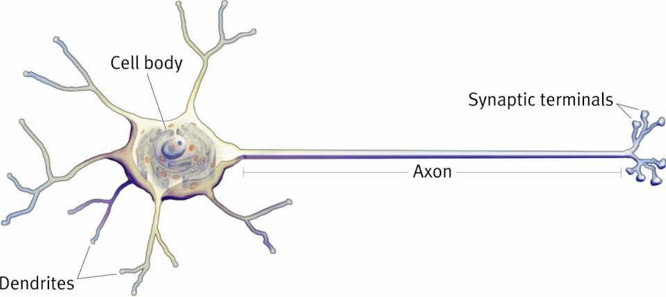
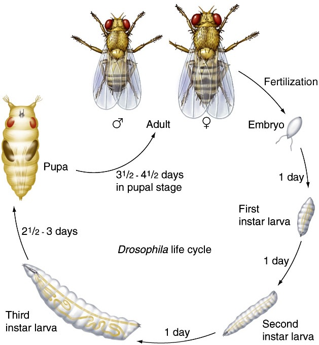

\begin{titlepage}

\centering\large
\vspace*{1.5cm}

{\LARGE\bf Characterizing the dynamics of a \textit{Drosophila} motoneuron model via bifurcation analysis}

\vspace{1.5cm}

\textbf{Bachelor Thesis in Physics}

by

\textbf{Johannes Rieke}

12 January 2015

\vspace{1.5cm}

Friedrich-Alexander-Universität Erlangen-Nürnberg

\vspace{1.5cm}
\includegraphics[width=0.3\textwidth]{images/fau-siegel.pdf}\par
\vspace{1.5cm}

Supervisor: Prof. Klaus Mecke

\end{titlepage}


# Abstract {.unnumbered}

A recently published computational model of the motoneuron MN1-Ib (aCC) in the third instar larva of *Drosophila* (Günay 2015) was investigated. Firstly, the model was converted to the simulator-independent NeuroML2 format. Then, its dynamics were analyzed: Depending on the current stimulus, the system showed four qualitatively different types of behaviour. Simulations revealed basic firing properties (firing rate, delay to first spike, spike amplitude) and the class of excitability. The steady-state I-V-curve was calculated to get a first impression of the equilibria of the system. Subsequently, numerical continuation was employed to characterize the phase space and bifurcations in detail. The onset of spiking was mediated by a saddle-node bifurcation, while the end of spiking (at strong stimuli) was mediated by a Hopf bifurcation. These bifurcations helped to explain the behaviour and spiking properties observed in simulations. Furthermore, two-parameter continuation was employed to investigate how the model behaviour changes if its ion currents are altered. This characterized the role of potassium and sodium currents for certain features of the behaviour. Eventually, the results from simulations and bifurcation analysis were used to explain some effects observed in experiments with MN1-Ib. 


\tableofcontents


# Introduction

## Recent Development in Computational Neuroscience 

Computational neuroscience has seen an enormous development over the last decades. Today, several efforts try to model significant parts of the nervous system. The most popular  example is certainly the EU-funded Human Brain Project, which aims to model the human brain. As an intermediate step, the researchers recently published a simulation of 30,000 morphologically realistic neurons of the rat cortex (Markram 2015). But also smaller programs aim to advance neuroscience by modelling complete nervous systems. For example, the OpenWorm project utilizes an open source approach to build a complete model of the roundworm *C. elegans* (Szigeti 2014). 

This progress in neuroscience was enabled by two technological developments: Firstly, the drastical increase of computer performance. Networks of neurons are highly complex, nonlinear systems. At any time, thousands of nerve cells influence each other concurrently. The only way to make theoretical predictions about such systems is numerical simulation. Today, even home computers offer the resources to carry out the complex computations involved in this process. Secondly, obtaining neuronal data became a lot easier during the past few years, especially through new experimental techniques. Today, it is possible to observe the activity of the whole brain (fMRI) as well as individual neurons (Calcium imaging, electrophysiology), to reconstruct the morphology of neurons and synapses in detail (electron microscopy), and even to stimulate neurons in vivo (optogenetics). The data obtained from these experiments is essential in building computational models of nerve cells. 


## Dynamical Systems Analysis in Neuroscience

The recent developments enable us to simulate networks with thousands of neurons simultaneously. Nevertheless, it is still hard to understand what an individual neuron does: How does it “behave” - in a general sense, not just in a specific configuration of the simulation? Which role does it have in the complex interplay of a network? In which way is its behaviour different from other neurons with similar or different electrophysiological profiles? Dynamical systems analysis offers valid tools to answer these questions. Specifically, it can yield insight about the *qualitative* behaviour of neurons. Whereas a simulation only calculates a specific state of the neuron, dynamical systems analysis can provide a complete picture of its behaviour: It shows in which situations the neuron is silent, spiking, oscillating, bursting, or doing something else, and how it transitions between these states. This qualitative approach helps greatly in building an intuition of model behaviour. Therefore, it enables the researcher to predict the outcome of experiments and simulations. Computational properties of a neuron can be inferred without having to deal with all underlying biophysical details. As Izhikevich (2007, p. 8) states: The “power of the dynamical systems approach to neuroscience [...] is that we can tell something [...] about a system without knowing all the details that govern the system evolution”. 


## Objective of the Thesis

In this thesis, the methods of dynamical systems analysis are applied to a specific neuron, namely the MN1-Ib motoneuron in the *Drosophila* larva. This neuron controls a muscle in the body wall and plays a central role for peristaltic motion of the larva. Computational models for this neuron were published recently (Günay 2015). The aim of this thesis is to give a clear picture of the neuron’s behaviour. Methods from the theory of dynamical systems are employed to characterize the mechanisms underlying this behaviour (bifurcation analysis). Subsequently, it is explained how the behaviour of the MN1-Ib neuron changes if its ion currents are altered. This yields insight about the functional role of sodium and potassium currents for model behaviour. Several issues of current research are explained and related to the results from bifurcation analysis. 

The thesis employs diverse methods, such as simulation, analysis of the neuron’s I-V-curve, and bifurcation analysis via numerical continuation. One focus is to show how these tools relate, and what their specific advantages are. This is especially important in neuroscience because researchers from different backgrounds usually employ different methods. For example, I-V-curves are a preferred instrument in neurobiology, while bifurcation analysis is usually employed in theory-oriented environments. A shared understanding of these tools can foster the exchange of knowledge in neuroscience. 


## Structure

Chapter 2 provides an overview of the theoretical background in three parts: Firstly, basic computational models of neurons are introduced. Secondly, the theory of dynamical systems is explained and related to neuroscience. The third part outlines the neurobiology of *Drosophila* and the properties of the MN1-Ib motoneuron. 

Chapter 3 describes the methods and software tools used in the thesis. It gives an overview of the computational model of the MN1-Ib neuron and introduces the software for simulation, data analysis, plotting, and bifurcation analysis. 

In Chapter 4, the results of the thesis are presented. The first part shows how the model behaved in simulations. This behaviour is subsequently explained by analysing the bifurcations of the model. The final part outlines how the model behaviour changed if the strengths of its ion currents were altered. 

Chapter 5 discusses these results and relates them to existing research. The behaviour of the model is compared to experiments, the computational properties of the MN1-Ib neuron are discussed, and the role of its ion currents is investigated. Limitations of the model and ideas for future research are outlined. 


# Theory

## Neurons and Computational Models

A neuron or nerve cell is the main computational unit of the nervous system. Its computational properties arise from the ability to control its ion concentration: The neuron membrane is made up of a lipid bilayer (as in most other cells), which is interspersed by channel proteins (fig. [#circuits]A). These channels control the flow of ions across the membrane (mainly sodium, potassium, and calcium). This way, the neuron can maintain a different ionic concentration and electric potential inside the cell than outside. This potential inside the cell is called membrane potential. 

Signal processing and communication with other neurons happen via changes in the membrane potential. Each neuron receives diverse inputs from many others. These changes of the membrane potential are processed and integrated through the neuron’s complex morphology. Depending on the strength and timing of the inputs, the neuron can emit a new electric signal or not. This signal is called action potential or spike and is eventually transferred to subsequent neurons. It should be noted that some rare types of nerve cells do not show action potentials (Koch 2004, p. 142). 


### Neuron Structure and Functioning {#neuron-structure}

Nerve cells usually show a complex morphology, which widely determines their properties. Mainly, the neuron can be divided into three sections: The dendritic tree (consisting of the dendrites), the soma (cell body), and the axon (fig. [#neuron-sections]). 


# Figure: {#neuron-sections}



Caption: [Structure of a neuron] ([http://bio3520.nicerweb.com/Locked/chap/ch03/neuron.html](http://bio3520.nicerweb.com/Locked/chap/ch03/neuron.html)). 


In the dendrites, the neuron receives input from other nerve cells, usually via synaptic connections (a form of chemical signal transmission, see below). In response to an action potential of the presynaptic cell, the synapse causes a flow of ions across the membrane of the postsynaptic neuron. Consequently, its membrane potential changes locally. Depending on the type of the synapse, it can either increase (depolarization, activating input) or decrease (hyperpolarization, inhibiting input). 

This local perturbation of the membrane potential spreads through ionic diffusion. On its way towards the soma, the electric signal mixes with inputs that arrive at other locations in the dendrites and at slightly different times. Summation of these signals (both spatially and temporally) is the main function of the dendritic tree. Dendrites are usually passive (i. e. they do not alter the incoming electric signals or fire action potentials), but can show active behaviour in some cases (Koch 2004, p. 428). 

The electric signals from the dendrites eventually merge at the soma and arrive at the spike initiation zone (usually located between soma and axon). Here, the decision to fire an action potential is made. In short, firing of a spike requires the membrane potential to be raised above a threshold value (we will see from the dynamical systems analysis in [#dynamical-systems] that this simple concept is not really correct, especially for some types of neurons). 

Biophysically, a spike is produced by voltage-gated ion channels along the axon (see [#hodgkin-huxley-model]). In response to a sufficient depolarization, they generate a transient flow of ions across the membrane, which causes a short and strong depolarization (the spike). Its shape (fig. [#spike]) is always more or less equal (as described earlier, from the dynamics point of view there are exceptions, see [#dynamical-systems]). In this sense, a spike is a discrete, all-or-none event. Once initiated, the spike activates ion channels in neighbouring regions of the axon and eventually spreads across its entire length.

At its end, the axon branches out and connects to subsequent neurons via synapses. There is no direct contact between the two cells. Instead, the spike signal is transmitted on a chemical pathway: The synapse releases neurotransmitters into the synaptic cleft (the space between the neurons). These chemicals bind to receptors on the postsynaptic membrane and cause a flow of ions across it. 


### Passive Membrane Model

For a simple neuron model, we treat the cell membrane as a purely passive structure (i. e. we omit any active ionic currents that generate spiking). Biologically, the membrane  consists of phospholipids, which act as a capacitance ``C`` between the interior and exterior of the cell. Also, the membrane is semipermeable to ions at any time. We can model this behaviour by a small conductance ``g_{leak}`` between the inside and outside (or a strong resistor, respectively). 


# Figure: {#circuits}


Caption: [Modelling a neuron membrane] (bottom is intracellular, top is extracellular). **A:** Membrane with ion channel (Horton 2006). **B:** Passive membrane model (adapted from Koch 2004, p. 7). **C:** Hodgkin-Huxley model (adapted from Koch 2004, p. 345). 


All in all, we can represent the nerve cell as a simple RC circuit (fig. [#circuits]A without the red part). For external stimulation, we add a current input ``I`` (with opposite direction to the other currents, in accordance with the literature). Using Kirchhoff’s circuit laws and Ohm’s law, we obtain a differential equation for the membrane potential ``V`` inside the cell (Koch 2004, p. 9):

```math {#membrane-equation}
\frac{dV}{dt} = - \frac{1}{C} (g_{leak} V - I)
```

This equation is often called membrane equation. For a temporary current stimulus with constant amplitude, it can be solved analytically (Koch 2004, p. 10): At the start of the current stimulus, the membrane potential increases slowly (the capacitance “charges”). At the end of the current step, it decreases back to the old equilibrium value.  

In this model, the membrane potential stays at zero without a current stimulus. However, real neurons are usually slightly depolarized at rest (between -30 mV and -90 mV, Koch 2004, p. 6). We can include this so called resting potential by adding a DC voltage source in line with ``g_{leak}`` (red part in fig. [#circuits]B). For ``I`` = 0, it drives the voltage towards ``E_{rest}``. The membrane equation becomes:

```math {#membrane-equation-rest}
\frac{dV}{dt} = - \frac{1}{C} (g_{leak} (V - E_{rest}) - I)
```


### Hodgkin-Huxley Model {#hodgkin-huxley-model}

The Hodgkin-Huxley model adds spiking behaviour to the passive membrane model. It was developed during the seminal work of Hodgkin and Huxley on the squid giant axon (Hodgkin 1952) and helped to unveil many of the biophysical mechanisms behind action potentials. Until today, it is widely used in neuroscience (see Catterall 2012 for a recent review). 

The key finding behind the Hodgkin-Huxley model is that spikes are caused by the interplay of two ionic currents: sodium (Na) and potassium (K). In response to a sufficient depolarization of the membrane, sodium channels open quickly. This causes an influx of Na into the neuron, which further depolarizes the membrane and initiates the spike. In response to this strong depolarization, the sodium channels close and slow potassium channels start to open. Now, K flows out of the neuron and drives the membrane potential back to the resting potential, which effectively ends the spike. However, due to their slow dynamics the potassium channels do not inactivate instantaneously. Hence, the membrane hyperpolarizes below its resting potential for a short amount of time. During this refractory period, the neuron’s excitability to trigger a new spike is drastically lowered (Koch 2004, p. 154f).

The sodium and potassium currents (``I_{Na}`` and ``I_K``) are added to the passive membrane model as shown in fig. [#circuits]C. The membrane equation becomes:

```math {#membrane-equation-hh}
\frac{dV}{dt} = - \frac{1}{C} (g_{leak} (V - E_{leak}) + I_{Na} + I_K - I)
```

In accordance with the literature, ``E_{rest}`` from eq. [#membrane-equation-rest] was rewritten as ``E_{leak}``. As described above, the sodium and potassium currents are voltage-dependent. They were modeled by Hodgkin and Huxley as

```math {#currents-hh}
I_{Na} = \bar{g}_{Na} m^3 h (V - E_{Na}) \\
I_{K} = \bar{g}_K n^4 (V - E_K).
```

Here, the strength of each ion current is mediated by the maximal conductance (``\bar{g}_{Na}`` or ``\bar{g}_K``) and a combination of the gating variables ``n``, ``m`` and ``h``. These dimensionless variables have values between 0 and 1 and activate (``n``, ``m``) or inactivate (``h``) the currents. Biophysically, they can be interpreted stochastically: For ``n^4`` = 0, all potassium channels are closed; for ``n^4`` = 1 they are open (accordingly for ``m^3 h`` and sodium). ``E_{Na}`` and ``E_K`` are the reversal potentials for the respective ions. 

The dynamics of the gating variables are voltage-dependent (i. e. the ion channels open or close according to the current membrane potential). They can be expressed in two equivalent ways: Either via rate constants ``\alpha_n (V)`` and ``\beta_n (V)`` as in

```math {#rates-hh}
\frac{dn}{dt} = \alpha_n (V) n + \beta_n (V) (1 - n).
```

or via a steady-state value ``n_{\infty}`` and a time constant ``\tau_n`` as in

```math {#steady-tau-hh}
\frac{dn}{dt} = \frac{n_{\infty}(V) - n}{\tau_n(V)}.
```

The functions for rate constants, steady-state values and time constants depend on the specific model properties. Often, they are expressed as sigmoid functions. Fig. [#spike] shows a spike simulated by the original Hodgkin-Huxley. Today, many simulations use variations of this model, for example with additional ion channels. 


# Figure: {#spike}

{width=60%}

Caption: [Membrane potential (top) of the Hodgkin-Huxley model] in response to a sub- and suprathreshold current stimulus (bottom; Koch 2004, p. 150). 


### Compartmental Models

The models above treat the neuron as a point-like structure: Each state variable is represented by a single value. For example, the membrane potential ``V`` is equal across the entire neuron (it is isopotential). In a real neuron however, the membrane potential differs across the complex morphology (see [#neuron-structure]). 

To incorporate this morphological heterogeneity, Rall (1989) modeled the neuron as a set of cables (cylinders of finite length). For a passive cable without stimulus, the membrane potential at a position ``x`` is described by the cable equation (Koch 2004, p. 30):

```math {#cable-equation}
\tau \frac{\partial V}{\partial t} = \lambda^2 \frac{\partial^2 V}{\partial x^2} - (V - E_{rest})
```

Here, ``\tau`` and ``\lambda`` are parameters based on the properties of the neuron. In numerical simulations, the positions need to be discretised. For this purpose, each cable is divided into several isopotential compartments. Today, most simulations of morphologically realistic neurons use compartmental models. 

As the model used in this thesis is isopotential (see [#mn1-ib-model]), the details of multi-compartmental models will not be discussed. For an introduction to the topic, see Koch 2004 (pp. 25-84). 


## Dynamical Systems in Neuroscience {#dynamical-systems}

The theory of dynamical systems was shaped in large parts by the work of Poincare in the 19th century. Initially, it was applied to problems in engineering and physics. Today, dynamical systems analysis is used in a broad range of disciplines that employ modelling and simulation (Strogatz 1994, pp. 2-4). The topic was first applied to neuroscience in a paper by Rinzel (1989).

Strogatz 1994 gives a general introduction to dynamical systems. A more comprehensive discussion can be found in Kuznetsov 1998, for example. The application of dynamical systems theory to neuroscience is presented in Izhikevich 2000 and Izhikevich 2007. 


### Definition: Dynamical System

A dynamical system consists of: 

1. A set of variables that completely describe the current state of the system. 
2. A set of laws that describe how these state variables evolve with time.

A dynamical system can be continuous in time (then the laws are differential equations) or discrete (then the laws are iterated maps or difference equations). In the following, only continuous systems will be described (for discrete dynamical systems see for example Strogatz 1994, pp. 348-388). The dimension of a dynamical system is equal to the number of its state variables. 

One example for a (continuous) dynamical system in neuroscience is the original Hodgkin-Huxley model described in [#hodgkin-huxley-model]: The state variables are the membrane potential ``V`` and the gating variables ``n``, ``m`` and ``h``. The laws are the differential equations for these variables (``dV/dt``, ``dn/dt``, ``dm/dt``, ``dh/dt``). The system is four-dimensional. 


### Elements of the Phase Space

The central concept of dynamical systems analysis is the phase space (or state space). It is made up of all possible states of the dynamical system (i. e. all possible combinations of state variables). For a two-dimensional system with state variables ``x`` and ``y``, the phase space is simply the Euclidean plane with axes ``x`` and ``y``. 

The current state of a dynamical system correlates to a unique point in the phase space. The differential equations of the system describe how this state changes, and therefore how its location in phase space changes. The equations can be visualised as a vector field in the phase space, which “pushes” the state of the system around. The line that connects subsequent points is called trajectory or orbit (Kuznetsov 1998, p. 8). 

Most phase spaces contain several special elements (for example equilibrium points or limit cycles) that attract or repel neighboring trajectories. These elements widely determine the possible trajectories of the system, and thus its behaviour. Together, they make up the so called phase portrait (Strogatz 1994, p. 19). 


#### Equilibria

Equilibria (or fixed points) are those points of the phase space at which all differential equations vanish. If a trajectory is at an equilibrium point, it will not move away from it (unless the system is perturbed). An equilibrium can be stable (all neighboring trajectories move towards it) or unstable (at least some neighboring trajectories move away from it). In neuron models, stable equilibria represent silent behaviour. 

The stability of an equilibrium can be determined analytically. For this purpose, we will linearize the differential equations of the system in a small region around the equilibrium (Strogatz 1994, pp. 150-151). We take a two-dimensional system

```math {#stability-system}
\dot{x} = f(x, y) \\
\dot{y} = g(x, y)
```

with a fixed point ``(x_0, y_0)``. This implies

```math {#stability-implication}
f(x_0, y_0) = g(x_0, y_0) = 0.
```

Now, we want to see how the state of the system at a point close to the equilibrium evolves. To describe this state, we introduce local coordinates

```math {#stability-linearization}
u = x - x_0 \\
v = y - y_0.
```

Taking the time derivative and applying a Taylor series expansion yields

```math {#stability-taylor}
\dot{u} = \dot{x} = f(x_0 + u, y_0 + v) = u \frac{\partial f}{\partial x} + v \frac{\partial f}{\partial y} + \mathcal{O}(u^2, v^2, uv) \\
\dot{v} = \dot{y} = g(x_0 + u, y_0 + v) = u \frac{\partial g}{\partial x} + v \frac{\partial g}{\partial y} + \mathcal{O}(u^2, v^2, uv).
```

As ``u`` and ``v`` are small, the quadratic terms can be omitted. We rewrite the time evolution of the local state in vector form: 

```math {#stability-vector}
\binom{\dot{u}}{\dot{v}} = \underbrace{
\begin{pmatrix}
\frac{\partial f}{\partial x}&\frac{\partial f}{\partial y} \\
\frac{\partial g}{\partial x}&\frac{\partial g}{\partial y} 
\end{pmatrix}
}_{=: J} \binom{u}{v}
```

Here, ``J`` is the Jacobian matrix of the system. Evaluated at an equilibrium, it describes how a state close to that equilibrium evolves with time. To infer the stability of the equilibrium, we can simply analyse the eigenvalues of ``J``: If an eigenvalue is negative, all trajectories in the direction of the respective eigenvector will move towards the equilibrium. If the eigenvalue is positive, they will move away from it. Hence, the equilibrium is stable if all eigenvalues of the Jacobian have negative real part and unstable if at least one eigenvalue has positive real part (Kuznetsov 1998, p. 22). 

This technique of linearization and eigenvalue analysis can be easily extended to systems with ``n`` dimensions. Then, the Jacobian ``J`` is a ``n \times n`` matrix and has ``n`` eigenvalues. The definition of stability remains the same.

Equilibria can be further classified (following the nomenclature in Izhikevich 2007, p. 104, and Kuznetsov 1998, p. 49): As nodes (all eigenvalues real and same sign), saddles (all eigenvalues real and at least two eigenvalues with opposite sign), and foci (at least two eigenvalues complex-conjugate). In the latter case, trajectories close to the equilibrium oscillate around it (due to the imaginary part of the eigenvalues). 

Fig. [#equilibria-classification] depicts typical trajectories and eigenvalues for all possible equilibria. Additionally, there are some rare types of equilibria which cannot be analysed via linearization (the quadratic terms in eq. [#stability-taylor] do not vanish for them). For a discussion of these borderline cases see Strogatz 1994 (pp. 151, 133-137). 


# Figure: {#equilibria-classification}


Caption: [Classification of equilibria in the phase plane] (adapted from Kuznetsov 1998, p. 49).


#### Limit Cycles

Limit cycles are isolated periodic solutions of a dynamical system (i. e. neighboring solutions in phase space are not periodic). If a trajectory is on a limit cycle, it will stay on it and keep oscillating (unless the system is perturbed). Like all periodic solutions, limit cycles need phase spaces with at least two dimensions. A limit cycle can be stable (neighboring trajectories spiral towards it), unstable (they spiral away from it) or - in rare cases - half-stable (trajectories inside the limit cycle spiral towards it, trajectories outside spiral away, or vice versa). In neuron models, stable limit cycles correspond to repeated spiking. 

Unlike with equilibria, there is no straightforward, analytical method to determine whether a given dynamical system has a limit cycle or not, and how its stability and shape is. For a discussion of some techniques to investigate these questions, see Strogatz 1994 (pp. 199-215). 


### Bifurcations

As the parameters of a dynamical system are altered, its phase portrait changes. Most of these changes are quantitative (e. g. equilibria move to new values, limit cycles change their shape), but some are qualitative (equilibria or limit cycles appear, disappear or change stability). These qualitative changes of the phase portrait are called bifurcations. As they substantially impact the possible trajectories, they usually lead to qualitatively different behaviours. For example, if the current stimulus (``I`` in eq. [#membrane-equation-hh]) is increased, bifurcations can switch neuron models from silent to spiking behaviour. 

Bifurcations are classified according to the number of parameters involved: Codimension-1 bifurcations occur if a single parameter of the system is varied. In contrast, codimension-2 bifurcations require two parameters to be changed simultaneously (Izhikevich 2007, p. 159). 


#### Bifurcations of Codimension 1

For phase spaces with at least two dimensions, there are six important types of codimension-1 bifurcations. Some of them involve only equilibria, some involve only limit cycles, and some involve both. In three and more dimensions, there are some additional bifurcations of limit cycles. However, they are not substantial for basic neuron behaviour (for details about them see Izhikevich 2007, pp. 190-192). The six important bifurcations are outlined below. Common alternative names are given in brackets. Here, the bifurcations are described in the direction of 1) stable equilibria disappearing and 2) stable limit cycles emerging. This is the typical behaviour at the onset of spiking in neurons. However, all bifurcations can also occur in the opposite direction (Izhikevich 2007, p. 209). Fig. [#bifurcations-phase-plane] shows the phase portrait before, during and after each bifurcation. 

The following two bifurcations destroy a stable equilibrium, without involving a stable limit cycle. In the phase space, a stable equilibrium corresponds to negative eigenvalues of the Jacobian (see [#equilibria]). The bifurcations of equilibria affect the stability (or existence) of the equilibrium. Therefore, at least one eigenvalue of the Jacobian crosses the imaginary axis and become positive.  

- *Saddle-node* (fold, limit point): A saddle and a node merge and vanish. At the bifurcation, one real eigenvalue crosses the imaginary axis. 

- *Subcritical Hopf*: An unstable limit cycle shrinks to a stable equilibrium, which becomes unstable. The two complex conjugate eigenvalues cross the imaginary axis. 

The following two bifurcations destroy a stable equilibrium and create a stable limit cycle in the same process:

- *Saddle-node on invariant circle* (SNIC, SLNC): Normal saddle-node bifurcation of equilibria that occurs on an invariant circle (i. e. any trajectory that starts on the circle ends on it). When the equilibria vanish, the circle becomes a stable limit cycle. 

- *Supercritical Hopf*: A stable limit cycle appears from a stable equilibrium, which becomes unstable. The two complex conjugate eigenvalues cross the imaginary axis. 

The following two bifurcations involve only limit cycles: 

- *Fold limit cycle* (saddle-node of limit cycle, saddle node of periodic orbits): A stable and unstable limit cycle appear together (“out of nowhere”) and move away from each other. 

- *Homoclinic* (saddle-homoclinic orbit): A homoclinic orbit to a saddle becomes a limit cycle (the saddle remains). Like the Hopf bifurcation, this can be divided into a supercritical case (limit cycle is stable) and a subcritical case (limit cycle is unstable). For neuroscience, only the supercritical case is important. Thus, we always refer to this case from now on (following the nomenclature in Izhikevich 2007, p. 185). 


# Figure: {#bifurcations-phase-plane}

{width=60%}

Caption: [Phase plane before, during and after a bifurcation] at ``\lambda`` = 0 (adapted from Izhikevich 2007, pp. 206-207).


#### Bifurcations of Codimension 2

Bifurcations of codimension 2 occur if two parameters of the system are changed concurrently. In neuroscience, they usually switch the complete behaviour and computational properties of a neuron. There are many different types of codimension-2 bifurcations. Three important examples are outlined below, for a complete overview see Kuznetsov 1998 (pp. 293-390). 

- *Cusp*: Two saddle-node points merge and vanish. 

- *Bogdanov-Takens*: Simultaneous saddle-node and Hopf bifurcation. Two complex conjugate eigenvalues cross the imaginary axis through the origin. Hence, their imaginary part vanishes and they become real. Furthermore, a homoclinic bifurcation always appears near the Bogdanov-Takens bifurcation (Izhikevich 2007, p. 195). 

- *Bautin* (generalized Hopf): Simultaneous Hopf and fold limit cycle bifurcation. The Hopf bifurcation changes from supercritical to subcritical (or vice versa). 


### Neurons as Dynamical Systems

Typical neuron models (like the Hodgkin-Huxley model in [#hodgkin-huxley-model]) are dynamical systems. Analysing their phase space can yield insight about the behaviour of the neuron. Specifically, we are usually interested in how a neuron reacts to current input (which may be caused either by synaptic activation or by artificial stimulation). To investigate this question, we look at the changes of the phase portrait as we alter the stimulating current ``I`` (eq. [#membrane-equation-hh]). 

Usually, for low values of ``I`` the neuron has a stable equilibrium, which corresponds to silent behaviour. A transient stimulus offsets the trajectory from this equilibrium: If it is weak, the trajectory decays right back towards the equilibrium; if it is strong enough, it sends the trajectory temporarily on a circle-like structure, which corresponds to a single spike. If the stimulating current ``I`` is raised, the neuron typically undergoes one or two bifurcations of codimension 1. These bifurcations destroy the stable equilibrium and create a stable limit cycle, which corresponds to (repeated) spikes. Therefore, the neuron transitions from silent to spiking behaviour. Typical combinations of bifurcations at this transition are shown in fig. [#bifurcation-combinations]. At very high values of ``I``, additional bifurcations may cause the neuron to stop spiking and switch back to silent behaviour. 


# Figure: {#bifurcation-combinations}


Caption: [Possible combinations of bifurcations at the onset of spiking] (transition from silent to spiking behaviour; Izhikevich 2007, p. 217). 


As outlined, bifurcations play a central role in neuroscience. They are the dynamical mechanisms behind the onset of spiking (and all other transitions of behaviour). Furthermore, neurons are only excitable (i. e. they are able to fire spikes) because they are close to such bifurcations (Izhikevich 2007, p. 215). The types of bifurcations that a neuron undergoes widely determine its behavioural and computational properties (Izhikevich 2007, p. 11). Fig. [#bifurcation-properties] gives an overview of such properties and the associated bifurcations. Some of these concepts are described in more detail below. 


# Figure: {#bifurcation-properties}

{width=70%}

Caption: [Neuron properties associated with the bifurcation at the onset of spiking] (Izhikevich 2007, p. 230).


#### Threshold

Simple descriptions of neurons often introduce the concept of a voltage threshold: If the membrane potential of the neuron rises above this value (at the spike initiation zone), an action potential is fired (see [#neuron-structure]). However, from the dynamical point of view the decision to fire a spike or not depends not only on the membrane potential, but on the state of the neuron in the phase space (and therefore on all state variables). 

Neurons with saddle-node bifurcations (on or off the limit cycle) at the onset of spiking show a threshold-like behaviour: Before the bifurcation, their phase portrait contains a saddle. Its stable manifold (i. e. the line of trajectories that move towards the saddle) serves as a separatrix between the rest state (stable equilibrium) and a spike (circle-like structure). A transient current pulse can push the trajectory from the stable equilibrium across this separatrix and cause a spike (Izhikevich 2007, pp. 238-239). However, the threshold is not a single value of the membrane potential, but a manifold of the phase space. In contrast, neurons with Hopf bifurcations at the onset of spiking lack a clear threshold behaviour. Their phase space does not contain a separatrix, and the stable equilibrium is a focus. Therefore, they usually fire in response to repeated stimulation, which brings the trajectory away from the focus (Izhikevich 2007, pp. 240-241). 


#### Firing Rate and Excitability Class {#excitability}

Tonic spiking of a neuron is caused by oscillations on a stable limit cycle. The properties of this cycle determine the firing rate (i. e. the frequency of spiking) and the spike amplitude. Depending on the type of bifurcation of the limit cycle, these values follow specific scaling laws, which are given in Strogatz 1994 (p. 264) or Izhikevich 2007 (p. 178). 

For the firing rate, two types of behaviour can be distinguished at the onset of spiking. These are described by the classification of excitability from Hodgkin (1948): Class 1 neurons can spike at arbitrarily low frequencies. At the onset of spiking, their firing rate increases continuously from zero to higher values (fig. [#hodgkin-classification] left). In contrast, class 2 neurons start spiking at non-zero frequencies. Their firing rate shows a discontinuous jump at the onset of spiking (fig. [#hodgkin-classification] right). Which class a neuron belongs to is determined by the bifurcation at the onset of spiking: A saddle-node on invariant circle bifurcation causes class 1 excitability, all other codimension-1 bifurcations cause class 2 excitability. 


# Figure: {#hodgkin-classification}

{width=80%}

Caption: [Firing rates for neurons with class 1 and 2 excitability] (Izhikevich 2007, p. 219).


Hodgkin’s classification of excitability describes the transition from silent to spiking behaviour (i. e. if the stimulus current is raised). However, this transition is not necessarily governed by the same bifurcation as the transition in the other direction (i. e. if the stimulus current is lowered). Izhikevich 2007 (p. 228) suggests a complementary classification for this situation: A neuron is class 1 spiking if it shows an arbitrarily low firing rate at the transition from spiking to silent behaviour, and class 2 spiking if it has a non-zero firing rate.


#### Bistability

At the onset of spiking, a neuron can be bistable, i. e. it can be silent or spike repeatedly for the same current input. This behaviour requires the coexistence of a stable equilibrium and a stable limit cycle. Therefore, these two elements have to be created/destroyed by two separate bifurcations. Usually, the system first undergoes a bifurcation that creates a stable limit cycle. Then (i. e. for a stronger current stimulus), a second bifurcation destroys the stable equilibrium. Bistability occurs for current stimuli between these two bifurcations. Possible combinations of bifurcations for this situation are shown in fig. [#bifurcation-combinations] (second and fourth row from the top). If a neuron is bistable, it can be switched from silent to spiking behaviour via short current pulses (Izhikevich 2007, pp. 10 and 13) or noisy current input (Izhikevich, p. 13).


#### Subthreshold oscillations

If the rest state of a neuron is a focus, it can show subthreshold oscillations: In response to a small current input (that does not cause a spike), the trajectory of the system oscillates around the focus while it settles towards it. Typically, oscillations occur in conjunction with Hopf bifurcations. 


#### Integrators and Resonators

Based on the bifurcation at the onset of spiking, neurons can be divided into integrators (saddle-node off or on limit cycle) and resonators (sub- or supercritical Hopf). These two neuron types show very different computational properties. Especially, integrators fire action potentials based on the strength of the stimulation (i. e. if the stimuli coming from the dendritic tree sum up to a certain value). In contrast, resonators prefer to fire if they receive multiple subsequent stimuli at a specific resonance frequency (Izhikevich 2007, p. 229-233). Hence, integrators and resonators serve different functions in the nervous system (Izhikevich 2007, p. 237). 


## *Drosophila* and its Motoneurons

*Drosophila melanogaster* is a species of small flies, commonly called fruit flies or vinegar flies. In this thesis (as well as in most available literature), the genus name *Drosophila* is used synonymously for the species name. *Drosophila* is one of the most widely used organisms in modern biology, especially in genetics and developmental biology. Its ascent was promoted by its easy handling and quick reproduction cycle. During the past decades, several nobel prizes were awarded for work on *Drosophila*. Its genome is completely sequenced, and a plethora of genetic manipulations exist. 

For neuroscience, *Drosophila* offers a good balance between the simplicity of its nervous system and the complexity of its behaviour. Roughly, *Drosophila* has 10^5^ neurons (human: 10^10^) and 10^7^ synapses. Many (though not all) of its neurons are identifiable (i. e. they exist in every specimen; Olsen 2008). This relatively small nervous system creates a range of complex cognitive abilities, such as recognizing objects, remembering positions, or learning (Olsen 2008). 


### Development and Anatomy

*Drosophila*’s reproduction cycle takes about two weeks from hatching to hatching (at 25 °C; Müller 2006, p. 79). Initially, the egg is contained in the ovary of the female animal. After fertilization, it develops towards an embryo and hatches. Then,  *Drosophila* undergoes three larval stages, which are separated by molting. Finally, it turns into a pupa and initiates metamorphosis. The adult animal emerges nine days after fertilization (Reece 2010, pp. 416-417; Müller 2006, pp. 79-81). Fig. [#development-cycle] gives an overview of this development cycle and the appearance at each stage. 


# Figure: {#development-cycle}

{width=60%}

Caption: [Development cycle of *Drosophila melanogaster*] (Hartwell 2010). 


The body of *Drosophila* shows a distinctive segmentation. This characteristic is prepared in the late embryo (Müller 2006, p. 87) and persists during the larval and adult stages. At a higher level, the body can be divided into three parts: The head, the thorax (in the adult animal, wings and legs are attached to this part), and the abdomen (Campbell 2010, p. 489). The thorax can be further subdivided into three segments (T1 to T3), the abdomen into eight segments (A1 to A8). Fig. [#larva-anatomy]A shows this segmentation at the larval stage. 

Throughout its development, the body of *Drosophila* undergoes many anatomical changes. Fig. [#larva-anatomy]B, C and D depict the anatomy of the central nervous system and the somatic musculature in the third instar larva. For details about the anatomy and development of other systems in the body see Hartenstein 1993. 


# Figure: {#larva-anatomy}


Caption: [Anatomy of the third instar larva]. **A:** Segmentation ([http://www.mun.ca/biology/desmid/brian/BIOL3530/DB_02/DBNDros.html](http://www.mun.ca/biology/desmid/brian/BIOL3530/DB_02/DBNDros.html)). **B:** Central nervous system (adapted from Hartenstein 1993, pp. 10-11). **C:** Somatic musculature (adapted from Hartenstein 1993, p. 40). **D:** Central nervous system (green) and muscles (red) in a dissected larva ([https://www.ncbs.res.in/node/436](https://www.ncbs.res.in/node/436)). Muscle 1 is located on the left and right side of each segment. 


### Organisation of Motoneurons

A motoneuron is a nerve cell that innervates and controls a muscle. Usually, it receives synaptic inputs from various sources, such as sensory neurons and central pattern generators (CPGs; Schaefer 2010). These neuronal circuits create rhythmic activity patterns and play a major role for locomotion in many animals, including humans (Duysens 1998). The motoneuron integrates these signals, possibly modifies them (Choi 2004), and sends action potentials to the subsequent muscle, which contracts in response. 

Motoneurons in *Drosophila* were studied at different stages of development: In the embryo (Goodmann 1984, Baines 1998, Sink 1991, Kim 2009), the larva (Sink 1991, Choi 2004, Kim 2009, Zwart 2013), during metamorphosis (Consoulas 2002), and in the adult fly (Ikeda 1988). Throughout this development, the nervous system changes significantly (see [#development-and-anatomy]). Its neuronal circuits are likely to change as well. The following paragraphs focus on the situation in the embryo and larva, which seem to be more or less similar in terms of motoneuron identities and organisation (Sink 1991, Kim 2009). 

*Drosophila*’s motoneurons are located dorsally on the ventral nerve cord (VNC; fig. [#larva-anatomy]B and D). This structure is symmetric along the midline (anterior-posterior axis). Each side can be divided into a number of half-segments or hemisegments, which correlate to the segments in the body. Each hemisegment contains a pattern of about 400 neurons, including an estimated 38 motoneurons (Kim 2009). For the hemisegments corresponding to abdominal body segments A2-A7, the number of motoneurons and their relative orientation are equal (Sink 1991; Choi 2004). However, in terms of electrical properties Srinivasan 2012 reports some segmental differences of the larval motoneurons. Fig. [#motoneurons]A shows the repetition of motoneurons in the hemisegments of the VNC. Fig. [#motoneurons]B presents the motoneurons of one hemisegment. 

The axons of the motoneurons project outwards from the VNC. They lead through dedicated nerves for each segment (fig. [#larva-anatomy]C and D and fig. [#motoneurons]B) and terminate on the body wall muscles (Sink 1991).


# Figure: {#motoneurons}


Caption: [Organisation of motoneurons in the third instar larva]. **A:** Segmental repetition of motoneurons in the VNC (Srinivasan 2012). **B:** Motoneurons in one hemisegment of the VNC (corresponding to abdominal segment A6; Sink 1991).  


### The MN1-Ib Motoneuron

The MN1-Ib motoneuron in *Drosophila* innervates the body wall muscle 1 (also called dorsal acute muscle 1; fig. [#larva-anatomy]C and D). Its name follows the nomenclature in Hoang 2001: MN is short for motoneuron, 1 is the number of the target muscle, Ib is the type of the axon terminal. The neuron is also called aCC (anterior corner cell, Sink 1991), especially in the embryo.  

The positions of MN1-Ib neurons in the VNC are indicated in fig. [#motoneurons]A and B. In each hemisegment, MN1-Ib is surrounded by various other motoneurons, which control different muscles in the body wall. Choi 2004 describes a group of five dorsomedial neurons, which includes MN1-Ib. This group shows a similar organisation, neuron morphologies and electrical properties for the hemisegments corresponding to abdominal body segments A2-A7 (Choi 2004). Also, the group (and especially MN1-Ib) seems to be widely conserved during development from embryo to larva (Choi 2004, Kim 2009). One other neuron in this group (MNISN-Is) innervates the same muscle as MN1-Ib, although its function is likely to be different. MN1-Ib seems to be the primary contributor to motor activity of the body wall muscle 1 (Schaefer 2010). 

Morphologically, the MN1-Ib neuron has two dendritic arbors, which are highly branched (fig. [#mn1-ib-morphology]; Kim 2009). Its axon projects outwards from the ganglion through the intersegmental nerve. At its end, it innervates the muscle with big (Ib-type) synaptic boutons (fig. [#mn1-ib-morphology]B; Choi 2004, Hoang 2001). 


# Figure: {#mn1-ib-morphology}


Caption: [Morphology and connectivity of MN1-Ib]. **A:** Morphology (Choi 2004). **B:** Axon and body wall muscles 1 to 8 (in the embryo; Sink 1991). 


# Methods and Tools


## Availability of Data

All material from this thesis is publicly available on GitHub: The LEMS and NeuroML2 versions of the model are included in the repository of the original model by Cengiz Günay ([https://github.com/cengique/drosophila-aCC-L3-motoneuron-model](https://github.com/cengique/drosophila-aCC-L3-motoneuron-model)). Additionally, they are accessible via OpenSourceBrain ([http://www.opensourcebrain.org/projects/drosophila-acc-l3-motoneuron-gunay-et-al-2014](http://www.opensourcebrain.org/projects/drosophila-acc-l3-motoneuron-gunay-et-al-2014)).  Everything else (simulation data, scripts for data analysis and numerical continuation) is available in a separate repository for this thesis ([https://github.com/jrieke/drosophila-dynamics](http://www.opensourcebrain.org/projects/drosophila-acc-l3-motoneuron-gunay-et-al-2014)). 


## Computational Model for MN1-Ib {#mn1-ib-model}

In this thesis, the MN1-Ib neuron in *Drosophila* was investigated. Günay 2015 recently published three computational models for this neuron with increasing complexity: 

1. An isopotential, single-compartmental model implemented in XPP (Ermentrout 2003). This model replicates the experimental f-I-curve and delays to first spike. However, it predicts a wrong spike amplitude and interspike membrane potential (Günay 2015). 

2. A two-compartmental model (soma and axon) implemented in XPP. This model was published previously in Lin 2012 (with slightly different parameters). In contrast to the isopotential model, it replicates the correct spike shape.  

3. A multi-compartmental model (based on a reconstructed neuron morphology) implemented in NEURON (Carnevale 2006). 

Only the first model was used for the bifurcation analysis in this thesis (due to its small parameter and phase space). This model is an extension of the original Hodgkin-Huxley model (see [#hodgkin-huxley-model]). It contains a leak current and four different types of active ion currents: Fast potassium (Kf), slow potassium (Ks), transient sodium (Na), and persistent sodium (NaP). Ca- and Ca-gated channels were omitted because they had no effect on spike generation in experiments. The equations for membrane potential, currents and gating variables widely follow the formalism in eq. [#membrane-equation-hh] to [#steady-tau-hh] (except for a second inactivation gating variable for the Kf current). Steady-state values were expressed as sigmoid functions of ``V``, time constants as sigmoid functions or constant values. 

All parameters of the model are given in Günay 2015 (especially table 5 and and fig. 1F). They were obtained from several recordings, some of which were performed on MN1-Ib itself (Günay 2015), and some on other neurons (cultured neurons of the *Drosophila* embryo (O’Dowd 1988) and cells from *Xenopus* that heterologously expressed *Drosophila*’s *DmNav* gene (Lin 2009)). To keep the model at the resting potential observed in experiments, a default holding current of ``I`` = -12 pA was applied (Günay 2015, Lin 2012). 


## Conversion of the Model to LEMS and NeuroML2 {#conversion}

The isopotential model of MN1-Ib was converted from XPP to NeuroML2. NeuroML is a simulator-independent, declarative language for neuronal modelling (Gleeson 2010, Cannon 2014). Its implementation is based on the popular XML format (eXtensible Markup Language). The main advantages of NeuroML over simulator-specific languages are portability (NeuroML can be run in various simulators and converted to a range of formats), modularity (NeuroML elements can be easily reused for other models) and scalability (NeuroML elements can be put together to form more complex models). See also Cannon 2007 for a discussion of modelling languages in neuroscience. 

NeuroML2 (the newest version of the NeuroML language) is based on LEMS (Low Entropy Model Specification; Cannon 2014), a generic schema to describe scientific models of any kind. Like NeuroML2, it is implemented in XML. LEMS allows the user to create so called *ComponentType*s, which define parameters, state variables, differential equations etc., and serve as building plans for the respective *Components*.  For example, the user can define a neuron model once (as a *ComponentType*) and create multiple instantiations (*Components*) for a network simulation. All objects of NeuroML2 (for example cells and channels) are implemented as such *ComponentType*s in LEMS. This allows easy extension and modification. 

The conversion of the isopotential model to NeuroML was performed in two steps: Firstly, a pure LEMS version was created (i. e. without any of the *ComponentType*s defined by NeuroML2). A LEMS *ComponentType* for the cell was created. Then, the differential equations and parameters  of the model were transformed from XPP to the respective elements in LEMS. Secondly, a model in native NeuroML2 was created. The NeuroML2 elements (channels, cell, network with current stimuli) were split up into several files to allow easier reusability. Some custom LEMS *ComponentType*s were created to account for missing features in NeuroML2 (such as the two inactivation gates of the Kf current, see [#mn1-ib-model]). 

Finally, automated tests were added to ensure the consistency of all models. These tests check the spike times in response to a constant current step. The results of the comparison are presented in [#consistency-of-models]. 


## Simulation and Data Analysis

Simulations were run in XPP (for the original model) and jnml (for the converted LEMS and NeuroML2 models). The Euler algorithm for numerical integration was employed at a time step of 0.001 ms. Data was exported as text files in a CSV-style format (variables as columns, time steps as rows). 

Data analysis was performed with Python 2.7.8 for Windows 32 bit (van Rossum 1995). All code is available in the form of interactive Jupyter/IPython notebooks (Pérez 2007). For data handling and analysis, the Python packages numpy (version 1.10.1) and scipy (version 0.16.1) were used. Plots were created with matplotlib (version 1.5.0). 

To calculate spike properties, simulations with constant current steps were run for at least 500 ms. The first 100 ms and last 10 ms of each run were omitted for analysis to prevent edge effects. From the remaining voltage traces, spikes were detected with a threshold of -25 mV. Based on the spike times, the mean values of firing rate, spike minima and spike maxima were calculated. In all cases, spiking was very regular, i. e. the standard errors of spike properties were negligible. 


## Steady-State I-V-Curve {#i-v-methods}

To get a first impression of equilibria in the system, the steady-state I-V-curve was analysed. It shows the overall current flowing into the neuron, if all gating variables are at steady state. It was calculated with:

```math {#i-inf}
I_{\infty}(V) = I_{\mathrm{Ks}, \infty}(V) + I_{\mathrm{Kf}, \infty}(V) + I_{\mathrm{Na}, \infty}(V) + I_{\mathrm{NaP}, \infty}(V) + I
```

Here, ``I`` is the stimulating current and ``I_{x, \infty}`` are the steady-state ion currents. They were expressed as in eq. [#currents-hh], with the gating variables replaced by their steady-state values (see also eq. [#steady-tau-hh]). Parameters values were set as in the original model (see [#mn1-ib-model]). 

Calculation and plotting were performed with the same toolset as the data analysis described in [#simulation-and-data-analysis] (Python 2.7.8, numpy, matplotlib). The code is available as a Jupyter/IPython notebook. 


## Numerical Continuation

Bifurcations were analysed via numerical continuation. This technique tracks the location of equilibria or limit cycles as one or more parameters of the dynamical system are varied. Bifurcations are detected by analysing the eigenvalues of equilibria (or multipliers for limit cycles). For a detailed introduction to the methods behind numerical continuation see Kuznetsov 1998 (pp. 463-535). In this thesis, the numerical continuation software AUTO-07p was used (version 0.9.1, installed on Windows via MinGW; Doedel 2007). The model equations were defined in C. Parts of the code were generated from the LEMS version of the model (see [#conversion]) via jNeuroML. Scripts to run the continuation were written for AUTO’s built-in Python interface. They are available as Jupyter/IPython notebooks. 


# Results

## Consistency of the Models in XPP, LEMS and NeuroML2 {#consistency-of-models}

The isopotential model used for this thesis was transformed from the original XPP format to LEMS and subsequently to NeuroML2 (see [#conversion] for details). All models were run for the same current steps with XPP and jnml, respectively. The resulting outputs (plots of membrane potential, gating variables and currents) were successfully checked for visual consistency. Fig. [#xpp-neuroml2] compares voltage traces from the XPP and NeuroML2 model for a constant current step. 

The simulation run shown in this figure was also analysed numerically: Spike times were detected via a voltage threshold of -25 mV and compared. The spike times of the LEMS model agreed completely with the XPP model. The NeuroML2 version showed some slight deviations (maximum 0.601 ms). However, this effect was attributed to numerical errors, because the deviations decreased when the simulation was run at a lower time step. 


# Figure: {#xpp-neuroml2}


Caption: [Screenshots of the same simulation run in XPP (**A**) and jnml/NeuroML2 (**B**)]. Current step of 0 pA for 500 ms.


## Model Behaviour in Simulations

To characterize the behaviour of the MN1-Ib model, simulations were run with constant current steps. Depending on the strength of the stimulus, the neuron showed different types of silent and spiking behaviour. Spiking properties (firing rate, spike amplitude, delay to first spike) were calculated from the voltage traces. 


### Qualitative Behaviour {#qualitative-behaviour}


# Figure: {#voltage-traces}


Caption: [Membrane potential (top) for different current stimuli (bottom)]. A-D show qualitatively different behaviours according to table [#regions]. Model at rest (``I`` = -12 pA) initially. Constant current steps for 200 ms. In A and B, short square current pulses were added. 
**A:** Silent behaviour at low currents. In response to a short square current pulse, the neuron fires a single spike.
**B:** Bistable behaviour. The system can be switched from silent to spiking behaviour (and back) via short square current pulses.
**C:** Tonic spiking.
**D:** Silent behaviour and oscillations at high currents.


The model showed four qualitatively different types of behaviour. These occurred in different regions of the stimulating current ``I``, hereafter denoted as A to D. Table [#regions] shows the values of ``I`` for each region and the associated behaviour. Typical voltage traces for all regions are depicted in fig. [#voltage-traces]. 

For weak stimuli (A), the neuron stayed silent. When the current step was applied, its membrane potential increased slowly and saturated towards a new equilibrium value. Subthreshold oscillations were not observed. In response to a short square current pulse, the neuron fired a single spike and returned to rest (fig. [#voltage-traces]A). At the default bias current of ``I`` = -12 pA, the neuron had a resting potential of (-54.56 ``\pm`` 0.01) mV. 

In region B, the neuron was bistable, i. e. it was able to show both silent and (tonic) spiking behaviour. Which behaviour was observed depended on the previous state of the system (hysteresis behaviour, see [#firing-rate]). The model could be switched from silent to spiking behaviour by short depolarizing current pulses, or from spiking to silent behaviour via short hyperpolarizing current pulses (fig. [#voltage-traces]B). The bistable region was very small (< 1 pA, compare table [#regions]). 

For higher currents (C), the neuron transitioned to tonic spiking. Single spikes could not be observed in response to constant current steps. The rheobase (minimum amount of sustained current input to stimulate spiking) was (-1.90 ``\pm`` 0.01) pA (for simulations of max. 5000 ms). Region C spanned a large range of currents, and spiking properties differed accordingly. In short, at higher currents the neuron started to fire earlier, more frequently and with lower spike amplitudes. A detailed analysis of these properties is given in [#firing-rate], [#delays] and [#amplitudes]. 

For very large stimuli (D), the model stopped firing and became silent again. In response to the current step, a single spike was emitted. Subsequently, the membrane potential oscillated towards a stable equilibrium value (which was much higher than the equilibrium values in region A). 


# Table: {#regions}

| Region | ``I`` / pA | Behaviour |
|:---:|:---:|:---:|
| A | ≤ -2.73 | silent |
| B | -2.72 to -1.89 | bistable |
| C | -1.90 to 59.69 | spiking |
| D | ≥ 59.70 | silent (with oscillations) |

Caption: [Current regions A to D] in which the neuron model showed qualitatively different behaviours.


### Firing Rate


# Figure: {#f-i-curve}


Caption: [Firing rate for various current steps (f-I-curve)]. Tonic spiking in the bistable region B was achieved by decreasing the current from region C. Arrows indicate hysteresis behaviour. Error bars not shown due to small size. 


For tonic spiking in region B and C, the firing rate of the neuron model (i. e. the frequency of spikes) was calculated from simulations. It is shown in the so called f-I-curve in fig. [#f-i-curve]. The firing rate increased with the strength of the stimulation and approached a constant value for high current stimuli. In all simulations, spiking was very regular, i. e. the period between subsequent spikes was more or less constant. Adaptation or bursting was not observed. 

At the onset of spiking, the neuron showed a clear hysteresis behaviour: If the current was slowly increased (starting with silent behaviour in region A), the neuron stayed silent in the bistable region B. At the transition to region C (rheobase), it started to spike tonically with non-zero frequencies (blue arrow in fig. [#f-i-curve]). Conversely, if the current was slowly decreased (starting with spiking behaviour in region C), the neuron continued to spike in the bistable region B. Its firing rate approached zero at the transition to the silent region A (red arrow in fig. [#f-i-curve]). According to the (extended) Hodgkin classification of excitability (see [#excitability]), the neuron is therefore class 2 excitable and class 1 spiking. This indicates that the silence-tonic and tonic-silence transitions are governed by different bifurcations. 

For small current stimuli (near the onset of spiking), an inverse logarithmic function could be fit to the firing rate (red curve in fig. [#f-i-curve]). According to the scaling laws referenced in [#excitability], this implies that the bifurcation at the transition from region A to B is a homoclinic bifurcation. 


### Delays

In region C (tonic spiking), the neuron needed some time to start spiking after the current step was applied (see voltage trace in fig. [#voltage-traces]C). This delay to first spike was calculated from simulations and is shown in fig. [#plot-delays]. The delay was negligible for large currents, but increased notably for small currents close to the onset of spiking. By tweaking the decimal numbers of the stimulating current (and therefore getting it closer to the exact rheobase current), the delay could be increased to arbitrarily large values (for example 2.7 s at an amplitude of 1.90 pA). 


# Figure: {#plot-delays}


Caption: [Delay to first spike for various current steps]. Model was at rest initially, then a constant current step was injected and the time to the first spike measured (spike detection via voltage threshold of -25 mV). Error bars not shown due to small size. 


### Spike Amplitudes {#amplitudes}

For tonic spiking (B and C), the spike minima and maxima were calculated (minimum means the minimal membrane potential between spikes, maximum means the maximal membrane potential during a spike). Spike amplitudes were calculated as the difference between minima and maxima. Fig. [#minima-maxima-amplitudes] presents all values for different current steps. 

Spike amplitudes were large for strong stimuli and vanished for weak stimuli. At the transition to region D, they could be approximated by a square function (red curve in fig. [#minima-maxima-amplitudes]). This implies that there is a supercritical Hopf bifurcation at this transition (see [#excitability]).  


#Figure: {#minima-maxima-amplitudes}

 \


Caption: [Spike minima, maxima (top) and amplitudes (bottom) for various current steps]. Dashed lines indicate amplitudes. Setup equal to fig. [#f-i-curve]. Error bars not shown due to small size. 


## Steady-State I-V-Curve {#i-v-results}

As an intermediate step to the bifurcation analysis, the steady-state I-V-curve of the model was calculated (see [#i-v-methods]). This curve shows the overall current ``I_{\infty}`` that is flowing into the neuron at a given membrane potential ``V``, if the gating variables have settled into steady state. Fig. [#i-v-curve] depicts the curve for four representative values of the stimulating current ``I``. 


# Figure: {#i-v-curve}


Caption: [Steady-state I-V-curve for different values of the stimulating current ``I``].


In all cases, the curve had a N-shape. At the intersections with the horizontal axis, there is no current flowing into or out of the neuron. Hence, these points represent equilibria of the system (Izhikevich 2007, p. 161). However, based on the I-V-curve itself no conclusions about their stability can be drawn. 

For weak stimuli (region A), the steady-state I-V-curve showed an equilibrium at low membrane potentials ``V``. As the neuron is silent in this region (fig. [#voltage-traces]A), the equilibrium is probably stable. As ``I`` was increased, the curve moved downwards (i. e. to smaller values of ``I_{\infty}``). Subsequently, the right arc of the curve crossed the horizontal axis and created two new equilibria. At ``I`` = -2.72 pA (transition from region A to B), no qualitative change in the I-V-curve could be observed. At ``I`` = -1.90 pA (transition from region B to C), the left arc of the curve crossed the horizontal axis. Hence, two intersections with the horizontal axis (i. e. equilibria) merged and disappeared. This indicates a saddle-node bifurcation at the onset of spiking. After the bifurcation (in region C), the I-V-curve had only one equilibrium left. As the neuron was spiking repeatedly in this region, the equilibrium is probably unstable. At ``I`` = 59.70 pA (transition from region C to D), the I-V-curve showed no qualitative change. However, the monotonicity of the curve at this transition indicates a Hopf bifurcation (Izhikevich 2007, p. 161). 
 

## Bifurcation Analysis

The neuron model of MN1-Ib represents a dynamical system with eight dimensions. The state variables are the membrane potential ``V`` and the gating variables ``m_{Ks}``, ``m_{Kf}``, ``h_{Kf}``, ``h_{Kf2}``, ``m_{Na}``, ``h_{Na}``, ``m_{NaP}``. Therefore, the Jacobian (see [#equilibria]) has eight eigenvalues. 

Equilibria and limit cycles of the system were analysed via numerical continuation (see [#numerical-continuation]). Several bifurcations of codimension 1 were detected in response to changes of the stimulating current ``I``. These bifurcations alter the qualitative behaviour of the neuron, and correspond to the transitions between regions A to D described in [#qualitative-behaviour]. The bifurcation diagram in fig. [#bifurcation-diagram] shows the location of equilibria, limit cycles and bifurcations. 

To give a better impression of the phase space, some exemplary situations from regions A to D are shown in fig. [#phase-space-plots]. These plots depict two of the eight dimensions of the phase space, namely the membrane potential ``V`` and the activation of the fast potassium current ``m_{Kf}``. As in most neuron models, the dynamics in the MN1-Ib model can be divided into one fast and one slow subprocess (Izhikevich 2007, pp. 147-150). Here, ``V`` belongs to the fast, ``m_{Kf}`` to the slow subprocess. Therefore, plotting these variables against each other yields a good impression of the actual phase portrait. The trajectories in the plots correspond to the voltage traces in fig. [#voltage-traces]. 


# Figure: {#bifurcation-diagram}


Caption: [Bifurcation diagram for changing ``I``]. Green solid line: Stable equilibrium. Green dashed line: Unstable equilibrium. Blue line: Minimum/maximum of limit cycle. SN: Saddle-node bifurcation. H: Hopf bifurcation. 


# Figure: {#phase-space-plots}


Caption: [Two-dimensional subset of the phase space for different stimulating currents ``I``]. Trajectories correspond to voltage traces in fig. [#voltage-traces]. Locations of equilibria and the limit cycle were taken from the bifurcation diagram in fig. [#bifurcation-diagram]. 


### Overview

For low values of ``I``, the system had a stable equilibrium (solid blue line in fig. [#bifurcation-diagram], black circle in fig. [#phase-space-plots]A). This corresponds to the silent behaviour observed in region A (see [#qualitative-behaviour]). As the stimulating current was increased, the stable equilibrium moved slowly towards higher values of the membrane potential ``V``. Two unstable equilibria originated from a saddle-node bifurcation (SN in fig. [#bifurcation-diagram], compare also the right arc in the I-V-curve, [#i-v-results]). However, these unstable equilibria did not alter the (silent) behaviour of the model at this point. 

At ``I`` = -2.72 pA (transition from region A to B), a stable limit cycle was created via homoclinic bifurcation. In fig. [#bifurcation-diagram] and fig. [#phase-space-plots]B and C, the limit cycle is indicated by its minimal and maximal membrane potential. At ``I`` = -1.90 pA (transition from region B to C), a saddle-node bifurcation extinguished the stable equilibrium. This is in agreement with the class 2 excitability of the neuron observed in simulations (see [#firing-rate]) and the results from the steady-state I-V-curve (see [#i-v-results]). 

With increasing ``I``, the amplitude of the limit cycle decreased. At ``I`` = 59.70 pA (transition from region C to D), it became so small that it merged with the unstable equilibrium inside of it via a supercritical Hopf bifurcation (H in fig. [#bifurcation-diagram]). This created a new stable equilibrium, which governed the silent behaviour in region D. 


### Onset of spiking

The transition from silent to spiking behaviour is controlled by the interplay of two bifurcations: The homoclinic bifurcation at ``I`` = -2.72 pA creates the stable limit cycle, which corresponds to tonic spiking. The saddle-node bifurcation at ``I`` = -1.90 pA extinguishes the stable equilibrium, which corresponds to silent behaviour. 

Between these bifurcations (i. e. in region B), the stable equilibrium and the stable limit cycle coexist. The trajectory of the system can stay on either one. This explains the bistability of silence and tonic spiking described in [#qualitative-behaviour] and [#firing-rate]. In simulations, short square current pulses could be used to switch the neuron between these two behaviours (fig. [#voltage-traces]B). The phase portrait explains this effect (fig. [#phase-space-plots]B): Between the stable equilibrium and the stable limit cycle, there is an unstable equilibrium. Its stable manifold serves as a separatrix: All trajectories on the left move towards the stable equilibrium, all trajectories on the right move towards the limit cycle. The current pulses “push” the trajectory across this separatrix (and thus towards the equilibrium or the limit cycle), as indicated by the arrows in the inset in fig. [#phase-space-plots]B. 

At the onset of spiking, the neuron showed a considerable delay to first spike in simulations (see [#delays]). This effect can be explained by the saddle-node bifurcation: Before the bifurcation, the system has a stable equilibrium. At its position in phase space, all differential equations are zero. After the bifurcation, this equilibrium is gone, but the differential equations at its former position are still very small. Therefore, the trajectories move very slowly through this region - they are affected by the “ghost” of the equilibrium, which causes the delay to first spike (Izhikevich 2007, p. 246). 


### Amplitude and Frequency of the Limit Cycle

With increasing ``I``, the amplitude of the stable limit cycle became smaller. The shape of its minimal and maximal membrane potential (fig. [#bifurcation-diagram]) matches the spike minima and maxima recorded in simulations (fig. [#minima-maxima-amplitudes]). In [#amplitudes], the spike amplitudes near the end of spiking were fitted by a square-root function. This predicted a supercritical Hopf bifurcation, which was verified by numerical continuation (fig. [#bifurcation-diagram]). 

During the numerical continuation of the limit cycle, the frequencies of the cycle were recorded (results not shown). Their values replicated the f-I-curve in fig. [#f-i-curve]. As described in [#firing-rate], this curve was fit by an inverse logarithm at the onset of spiking. This predicted a fold limit cycle bifurcation, which was verified by numerical continuation (fig. [#bifurcation-diagram]). 


### End of spiking

The transition from spiking to silent behaviour was caused by a supercritical Hopf bifurcation at ``I`` = 59.70 pA. This bifurcation created a stable equilibrium. Its eigenvalues were analysed from the output of the numerical continuation. As expected, they contained imaginary parts and unmasked the equilibrium as a focus. This explains the oscillations of the neuron in region D (fig. [#voltage-traces]D, see also oscillations of the trajectory around the equilibrium in fig. [#phase-space-plots]D). 


## Behaviour at Different Ion Current Parameters {#two-par-cont}

Numerical continuation in one parameter (the stimulating current ``I``) was able to explain the behavioural repertoire of the neuron. To investigate how  this repertoire changes if we alter the parameters of the model, numerical continuation in two parameters (``I`` and one other parameter) was employed. Specifically, the analysis here focuses on the conductances of the model (``g_{leak}``, ``g_{Ks}``, ``g_{Kf}``, ``g_{Na}``, ``g_{NaP}``). These variables represent the strength of the associated currents (compare eq. [#currents-hh]): If a conductance is zero, there is no current at all; if the conductance is high, the current is strong. Thus, analysing the conductances can yield insight about the role of each ion current for model behaviour. 

Fig. [#two-par-cont-plots] presents the results of the two-parameter continuation. Each diagram shows how the locations of the codimension-1 bifurcations (i. e. at which value of ``I`` they occur) change, if one conductance is altered (vertical axis). Therefore, a “horizontal slice” of the plot at one specific conductance value corresponds to a (one-parameter) bifurcation diagram as shown in fig. [#bifurcation-diagram]. In all diagrams, codimension-2 bifurcations are indicated by letters, default parameter values are indicated by dashed lines. Most of the effects revealed by two-parameter continuation were subsequently analysed in more detail, either by simulation or by plotting one-parameter bifurcation diagrams as in fig. [#bifurcation-diagram]. 


# Figure: {#two-par-cont-plots}

{width=50%} \
{width=same}
{width=same} \
{width=same}
{width=same}

Caption: [Two-parameter bifurcation diagrams for changing ``I`` and one conductance]. Dashed grey line: Default parameter value. Black line: Saddle-node bifurcation. Red line: Hopf bifurcation. BT: Bogdanov-Takens bifurcation. C: Cusp bifurcation. B: Bautin bifurcation. 


### Leak Current

If ``g_{leak}`` was decreased from its default value, the codimension-1 bifurcations of the system moved to lower values of ``I``. Therefore, the neuron needed weaker stimuli to start spiking; it became more excitable. At ``g_{leak}`` = 3.14 nS, the saddle-node bifurcation from the onset of spiking and the Hopf bifurcation from the end of spiking occurred at the same value of ``I``. However, these bifurcations affected different equilibria (therefore no codimension-2 bifurcation). For very small values of ``g_{leak}``, the saddle-node bifurcation from the onset of spiking stopped moving to lower values of ``I``, and changed direction to higher values of ``I``. Therefore, the S-shape of equilibria from the (one-parameter) bifurcation diagram in fig. [#bifurcation-diagram] became more “stretched”. 

If ``g_{leak}`` was increased from its default value, the codimension-1 bifurcations moved to higher values of ``I`` (i. e. spiking needed stronger stimuli; less excitable). The two saddle-node points approached each other. Consequently, the S-shape in the bifurcation diagram (fig. [#bifurcation-diagram]) became smaller. Eventually, the two bifurcations merged in a Cusp bifurcation and disappeared. Near this Cusp bifurcation (for a slightly smaller value of ``g_{leak}``), a Bogdanov-Takens bifurcation was observed. At this point, a subcritical Hopf bifurcation emanated from the saddle-node bifurcation that controls the onset of spiking. Additionally, a fold limit cycle bifurcation appeared (replacing the homoclinic bifurcation), which is consistent with theory (Izhikevich 2007, p. 195). Consequently, these two bifurcations dominated the onset of spiking for high values of ``g_{leak}`` (above the Cusp and Bogdanov-Takens bifurcation; see fourth row in fig. [#bifurcation-combinations]). The end of spiking was still governed by the supercritical Hopf bifurcation that was observed for default parameter values (see [#end-of-spiking]). Fig. [#high-gleak] shows a one-parameter bifurcation diagram for high ``g_{leak}``. It clearly depicts the fold limit cycle bifurcation as well as the two Hopf bifurcations. At this high value of ``g_{leak}``, the model showed oscillations similar to fig. [#voltage-traces]D in simulations. 

Above the Cusp and Bogdanov-Takens bifurcations, the codimension-1 bifurcations continued to move to higher values of ``I``. The distance of the Hopf bifurcations (in terms of ``I``) stayed more or less the same. At ``g_{leak}`` = 13.57 nS, they merged and disappeared. For ``g_{leak}`` values above this point, the system lacked a limit cycle. Therefore, it showed silent behaviour for arbitrary current stimuli. 


# Figure: {#high-gleak}


Caption: [Bifurcation diagram for changing ``I`` at high ``g_{leak}``] (8.84 nS). Green solid line: Stable equilibrium. Green dashed line: Unstable equilibrium. Blue line: Minimum/maximum of limit cycle. H: Hopf bifurcation. L: Fold limit cycle bifurcation. 


### Fast Potassium (Kf) Current

Changing ``g_{Kf}`` hardly affected the codimension-1 bifurcations of the system, even if it was increased 100-fold, or set to zero. Only the supercritical Hopf bifurcation at the end of spiking moved slightly in terms of ``I``. Therefore, the behaviour of the neuron stayed more or less the same for changes of ``g_{Kf}``. 


### Slow Potassium (Ks) Current

The two-parameter continuation for ``g_{Ks}`` showed similarities to gleak. This is plausible because both currents are inward, and should therefore have a similar effect on model behaviour. For smaller values of ``g_{Ks}`` than default, all codimension-1 bifurcations moved to lower values of ``I``. Therefore, the neuron needed weaker stimuli to start spiking and became more excitable. In contrast to ``g_{leak}``, the saddle-node bifurcation from the onset of spiking kept moving to lower values of ``I`` throughout the continuation, and did not change direction at some point. 

For values of ``g_{Ks}`` higher than default, all bifurcations moved to the right, and the neuron became less excitable. The two saddle-node bifurcations approached each other and merged in a Cusp bifurcation. As with ``g_{leak}``, a Bogdanov-Takens bifurcation occurred just before this Cusp bifurcation. It created a subcritical Hopf bifurcation and a fold limit cycle bifurcation. For high ``g_{Ks}``, the onset of spiking was dominated by these two bifurcations. The one-parameter bifurcation diagram looked similar to the one for high ``g_{leak}`` (fig. [#high-gleak]).  

For even higher values of ``g_{Ks}``, all bifurcations moved to higher values of ``I``. The two Hopf bifurcations moved away from each other (in terms of ``I``). Therefore, the neuron spiked repeatedly for a wider range of current stimuli. For very high ``g_{Ks}``, the Hopf bifurcations converged and eventually merged and disappeared (compare high ``g_{leak}``). Above ``g_{Ks}`` = 1107.57 nS, the system showed a stable equilibrium and silent behaviour for arbitrary current inputs. 


### Transient Sodium (Na) current

For lower values of ``g_{Na}`` than default, the bifurcations of the system moved to higher values of ``I``, i. e. the neuron became less excitable. At ``g_{Na}`` = 80.23 nS (i. e. if it was decreased by one fifth), the saddle-node points merged in a Cusp bifurcation. Slightly before this bifurcation, a Bogdanov-Takens bifurcation occurred and created a Hopf bifurcation. In contrast to high ``g_{leak}`` and high ``g_{Ks}``, this Hopf bifurcation was supercritical at first. Therefore, at this point the stable limit cycle of the system was created as well as destroyed by a supercritical Hopf bifurcation. However, the new Hopf bifurcation became subcritical at a slightly lower value of ``g_{Na}`` through a Bautin bifurcation. Additionally, the system now showed a fold limit cycle bifurcation. Therefore, at low values of ``g_{Na}`` the onset of spiking was governed by the same mechanism as for high ``g_{leak}`` and high ``g_{Ks}`` (fig. [#high-gleak]).  

For even lower values of ``g_{Na}``, the two Hopf bifurcations converged. Eventually, they merged in a Bautin bifurcation (which is “needed” to connect the loci of the subcritical and supercritical Hopf bifurcations). 

For high ``g_{Na}``, all bifurcations of the system moved to smaller values of ``I``, i. e. the neuron became more excitable. The saddle-node bifurcation from the onset of spiking moved more slowly. At ``g_{Na}`` = 223.85 nS, it occurred at the same value of ``I`` as the supercritical Hopf bifurcation from the end of spiking. 


### Persistent Sodium (NaP) current

For lower values of ``g_{NaP}`` than default, all bifurcations moved to higher values of ``I``. Thus, the neuron became less excitable. The two saddle-node bifurcations slightly approached each other, but always occurred at different values of ``I``. 

For high values of ``g_{NaP}``, all bifurcations moved to lower values of ``I``. The saddle-node bifurcation from the onset of spiking moved only slowly and almost stayed at the same value of ``I`` for very high ``g_{NaP}``. At some point, it occurred at the same value of ``I`` as the Hopf bifurcation from the end of spiking.


# Discussion

In this study, an isopotential model of the MN1-Ib motoneuron in *Drosophila* was investigated for its dynamics. In simulations, the model exhibited four different types of behaviour and diverse spiking properties. These effects were explained by three distinct bifurcations of codimension 1. Subsequently, it was shown how the bifurcations (and therefore the behaviour) of the model change if the strengths of its ion currents are altered. 


## Comparison to Experiments

In the simulations performed for this thesis (see [#qualitative-behaviour]), the model showed similar qualitative behaviour as in experiments (current-clamp recordings of abdominal and thoracic MN1-Ib neurons in Choi 2004, Hartwig 2008, Schaefer 2010): Silent behaviour for weak stimuli, a clear rheobase current, and regular tonic spiking above the rheobase (no single spikes, no adaptation). The bistability of the model in region B is not reported experimentally. However, this feature only persists for a small range of current stimuli (< 1 pA). Therefore, it was possibly overlooked in experimental setups, which typically stimulate the neuron in 20-pA-steps (Choi 2004, Schaefer 2010). 

For strong stimuli, the behaviour in simulations differs from experiments. While the isopotential model was silent for currents above 59.70 pA (due to a Hopf bifurcation), the experiments consistently show that MN1-Ib keeps spiking for strong currents (at least up to 100 pA). Accordingly, the oscillations of the model in region D (above the Hopf bifurcation) were not observed in experiments. However, some recordings from the MN5 neuron in (adult) *Drosophila* (Herrera-Valdez 2013, Berger 2015) show a similar behaviour to the MN1-Ib model near the Hopf bifurcation (tonic spiking below, oscillations above the bifurcation). This makes it at least plausible that a similar behaviour may exist in MN1-Ib at very high current stimuli.

In addition to qualitative behaviour, simulations and experiments roughly agree in terms of values for resting potential, rheobase, firing rates and delays. However, these values exhibit a strong variation in experiments (Choi 2004, Hartwig 2008, Schaefer 2010, Günay 2015), which may be attributed to differences in the experimental setups as well as natural neuron variability. This variability of MN1-Ib is consistent with other motoneurons in *Drosophila*, for example MN5 (Herrera-Valdez 2013). Therefore, comparing the exact values has a limited validity. 

In detail, the resting potential derived from simulations (-54.56 ``\pm`` 0.01) mV) lies in the same range as the values from experiments ((-56 ``\pm`` 1) mV in Choi 2004, (-46.6 ``\pm`` 1.3) mV in Schaefer 2010). However, the resting potential of the model is obviously determined by the default bias current of -12 pA. By tweaking this current slightly, the resting potential can be easily adjusted to any value between -50 mV and -60 mV (compare stable equilibrium in fig. [#bifurcation-diagram]). 

The rheobase of the model ((10.10 ``\pm`` 0.01) pA in relation to the bias current) is rather low in comparison to experiments ((27 ``\pm`` 5) pA in Choi 2004, (45 ``\pm`` 3) pA in Schaefer 2010). However, these experimental findings could be slightly biased towards higher values: Usually, the stimulation protocols use current steps of 0 pA, 20 pA, 40 pA, etc. to determine the rheobase. Therefore, neurons with low rheobase currents (say 5 pA) would still show quite large values in these experiments (at least 20 pA). Additionally, the rheobase currents of individual neurons varied significantly in experiments. 

Concerning spike properties, the qualitative features from simulations and experiments are in agreement. In brief, current clamp recordings showed that firing rate increases with stimulus strength (Schaefer 2010, Hartwig 2008), while delay to first spike decreases (Schaefer 2010, Choi 2004). The exact curves vary across studies and neurons. A comparison of firing rate and delay between the isopotential model and recordings is already given in Günay 2015 (see fig. 2B and C in there). The simulations for this thesis (fig. [#f-i-curve] and [#plot-delays]) replicate these results and extend the resolution and range in terms of the stimulus current ``I``. As stated in [#mn1-ib-model] and Günay 2015, the isopotential model fails to reproduce the correct spike shape and amplitude of the MN1-Ib neuron. Considering the phase portrait, this means that the properties of the limit cycle are wrong. 


## Computational Properties

For default parameter values, the model showed typical integrator properties in simulations (clear threshold and rheobase, no oscillations). This is in agreement with the properties of MN1-Ib observed *in vivo* (see [#comparison-to-experiments]). Bifurcation analysis unveiled that the onset of spiking is governed by subsequent fold limit cycle and saddle-node bifurcation. This combination of bifurcations causes the integrator behaviour ([#integrators-and-resonators]). For strong current stimuli, the system showed a supercritical Hopf bifurcation and oscillations as a typical resonator property. However, this behaviour is limited to strong stimuli and does not have a major impact on tonic spiking. Therefore, its effect on the computational properties of the neuron is likely small. Also, the Hopf bifurcation and oscillations were not observed experimentally (see [#comparison-to-experiments]). 

The computational properties of a neuron can change for different parameter values. More specifically, a Bogdanov-Takens bifurcation switches between integrator and resonator behaviour (Izhikevich 2007, pp. 195-196 and 251). As shown by two-parameter continuation (see [#two-par-cont]), the MN1-Ib model undergoes a Bogdanov-Takens bifurcation for changes in ``g_{leak}``, ``g_{Ks}`` and ``g_{Na}``. In all cases, the Bogdanov-Takens bifurcation occurred near a Cusp bifurcation. Together, these two bifurcations change the mechanism behind the onset of spiking from a saddle-node bifurcation to a Hopf bifurcation, and therefore from integrator to resonator properties. Hence, the neuron model is a resonator for high ``g_{leak}``, high ``g_{Ks}`` and low ``g_{Na}``. For changes in ``g_{Ks}`` and ``g_{NaP}``, no Bogdanov-Takens or Cusp bifurcations were observed. Nevertheless, experiments did not show any resonating properties for MN1-Ib (Choi 2004, Schaefer 2010, Hartwig 2008). Therefore, it is questionable whether MN1-Ib ever reaches the parameter values necessary for a Bogdanov-Takens bifurcation *in vivo*. Also, it is unclear whether it would make sense for a motoneuron to show resonating behaviour (considering its role as an integrator for signals from the CPG and other circuits). 


## Role of Ion Currents

The neuron model in this thesis contains a passive leak current, two outward potassium currents (fast Kf and slow Ks), and two inward sodium currents (transient Na and persistent NaP). To show how each current influences the model behaviour, two parameter continuation of the respective conductances was employed (see [#two-par-cont]).


### Comparison of Inward and Outward Currents

Stronger outward currents (Ks, Kf, leak) and weaker inward currents (Na, NaP) made the neuron less excitable (i. e. the bifurcations moved to higher values of ``I`` and the neuron needed stronger stimuli to transition to spiking behaviour). Conversely, weaker outward currents and stronger inward currents made the neuron more excitable. This is expected from a biophysical point of view: To start spiking, the neuron needs a strong inward current (usually sodium). Therefore, inward currents promote spiking, while outward currents prevent it. Using the two-compartmental version of the MN1-Ib model (see [#mn1-ib-model]), Lin 2012 showed that strong NaP increases the excitability of the neuron (and thus promotes seizure behaviour). This is consistent with the results from the isopotential model presented in this thesis. 

The currents Ks, Na and leak had a strong impact on model behaviour. Especially, varying these currents produced codimension-2 bifurcations, which switch the computational properties of the neuron (see [#computational-properties]). In contrast, the impact of NaP was weak and the impact of Kf almost negligible. As these currents are already weak in the default model, it is plausible that they do not have a major influence on the behaviour of MN1-Ib. This view is supported by Herrera-Valdez 2013, who constructed a minimal model of the MN5 neuron in (adult) *Drosophila*. It contains a leak current, one potassium current similar to Ks, and one sodium current (i. e. all currents that play a major role in the MN1-Ib model). Despite its simplicity, their model was able to replicate all experimentally observed behaviours of MN5, including tonic spiking and oscillations. In summary, a slow potassium current (like Ks) and a transient sodium current (like Na) seem to be the major (active) driving forces of behaviour in *Drosophila* motoneurons like MN1-Ib and M5. 


### Role of Potassium Currents for Spiking

Experimentally, the ion currents in MN1-Ib can be altered through genetic manipulation of the underlying ion channels. Hartwig 2008 present recordings from *Drosophila* larvae with decreased (EKI manipulation) and increased (EKO manipulation) potassium currents. For both manipulations, the MN1-Ib neuron showed a similar resting potential and firing threshold as in wild-type larvae. This seems to be consistent with the results from the two-parameter continuation for ``g_{Ks}`` and ``g_{Kf}``: In both cases, the saddle-node bifurcation at the onset of spiking stayed at more or less the same value of ``I`` for (moderate) changes of the conductance (fig. [#two-par-cont-plots]). Therefore, the stable equilibrium (which determines the resting potential) as well as the unstable equilibrium (which determines the firing threshold) should keep their location in phase space. 


### Role of the Kf Current for Spike Delays

In simulations, the MN1-Ib neuron showed a significant delay to first spike, especially near the onset of spiking (see [#delays]). This property is also reported in experimental setups for MN1-Ib as well as other motoneurons in *Drosophila* (Choi 2004, Schaefer 2010). *In vivo*, the delays seem to play a critical role for muscle behaviour: They control the recruitment order of motoneurons. For example, the body wall muscle 1 is innervated by MN1-Ib and MNISN-Is. The latter motoneuron shows a longer spike delay than MN1-Ib. As both neurons seem to receive the same synaptic input, the muscle is first activated by MN1-Ib and then (due to the longer delay) by MNISN-Is (Schaefer 2010). 

Experiments with *Drosophila* motoneurons indicate that a transient (A-type) potassium current plays a critical role for spike delays (Choi 2004, Schaefer 2010, Srinivasan 2012). This current is encoded by the *Shal* gene (Tsunoda 1995) and corresponds to Kf in the MN1-Ib model. From the dynamical systems point of view, the mechanism behind the spike delay in MN1-Ib is clear: The saddle-node bifurcation at the onset of spiking creates a region in the phase space, where the trajectory of the system moves very slowly (see [#delays]). This implies that the neuron should be able to exhibit spike delays as long as there is a saddle-node bifurcation - regardless of the underlying currents, and especially the existence of an A-type potassium current. The results of this thesis support this view: Firstly, the MN1-Ib model exhibits long delays even though its Kf current is very weak. Secondly, changing the strength of the Kf current did not have a significant effect on the saddle-node bifurcation at the onset of spiking (as shown by the two-parameter continuation in fig. [#two-par-cont]). 

If the A-type current would not play a significant role for spike delays, how could the results from experiments be explained? Firstly, some experiments show that spike delays decrease in *Drosophila*’s motoneurons if the A-type potassium current is blocked (by the drug 4-AP; Choi 2004) or disabled (by RNAi knockdown; Schaefer 2010, Srinivasan 2012). However, decreasing this current also reduces the excitability of the neuron, i. e. the bifurcations of the system move to lower values of ``I`` (the two parameter continuation in fig. [#two-par-cont-plots] indicates this only slightly, as the Kf current is very weak in this model). Therefore, the spike delays should also occur at lower current stimuli. If the neuron is stimulated with the same currents as before (as in the experimental setups), the delays seem decreased even though they have just moved to different values of ``I``. Secondly, it was found that spike delays decrease in response to prepulses. These current stimuli are applied before the actual current step that causes spiking (Choi 2004, Schaefer 2010). Prepulses are known to inactivate A-type currents (Choi 2004). However, they also bring the phase space of the neuron close to the saddle-node bifurcation. This is supported by Choi 2004, who report a membrane potential of (-43 ``\pm`` 1) mV during the prepulse (which should be close to the saddle-node bifurcation, compare also fig. [#bifurcation-diagram]). Therefore, during the prepulse the trajectory of the system can already move to the stable equilibrium near the location of the saddle-node bifurcation. If the current pulse is applied, it does not have to move through the (complete) slow region near the saddle-node bifurcation any more, but can quickly reach the limit cycle. 

All in all, an A-type potassium current does certainly play a role for spike delays in MN1-Ib and other motoneurons in *Drosophila*. However, the theoretical results from this thesis suggest that this current is not necessary to produce delays. This view is supported by the simulations from Herrera-Valdez 2013 with a minimal model of the MN5 motoneuron. Their model does not even contain an A-type potassium current (only a delayed-rectifier potassium current similar to Ks). Nevertheless, their model was able to produce delayed spiking. Future experiments could yield more insight about this issue. Especially, it would be interesting to see if the delays move to lower current stimuli if the A-type potassium current is blocked (as suggested above). 


## Limitations and Future Work

The model of the MN1-Ib neuron used in this thesis is a simple isopotential model with four active ion currents. Nevertheless, it was able to reproduce most features observed in experiments (see [#comparison-to-experiments]). In the following, several limitations of the existing model are discussed and directions for future research outlined. 


### Morphology and Model Complexity

As explained in [#mn1-ib-model], the isopotential model is the simplest out of three models of MN1-Ib published in Günay 2015. In this model, the whole morphology of the neuron (fig. [#mn1-ib-morphology]A) is “squashed” into a point. Each variable is represented by a single value for the complete neuron. The advantage of this modelling approach is that the system has few parameters and state variables. This makes it a lot easier to tune the model parameters and observe the behaviour. Eventually, the limited number of state variables also enabled the bifurcation analysis via numerical continuation presented in this thesis. 

Of course, the isopotential model also has some disadvantages: Primarily, it is not able to replicate the spike shapes observed in experiments. Also, it is questionable if the isopotential model would process real synaptic input correctly, as it does not enable dendritic summation of incoming signals. Nevertheless, the isopotential model certainly serves as a valid tool to analyse the MN1-Ib neuron in *Drosophila*. In the light of Occam’s razor, it is the simplest “hypothesis” about the functioning of the MN1-Ib neuron, which replicates (almost) all properties of experiments. Any additions to the model (like complex morphology) should be omitted as long as they are not necessary for the desired application. 

Does the bifurcation analysis of the isopotential model apply to the more complex models of MN1-Ib? In simulations, these models showed similar behaviour and properties as the isopotential model (except for spike shape; Günay 2015). This indicates that the equilibria, the limit cycle (at least its frequency) and the bifurcations are also similar. Future investigations could analyse the behaviour of the complex models in more detail, especially near the onset and end of spiking. As shown in this thesis, figuring out properties like the excitability class, the existence of bistability, scaling laws for firing rate and spike amplitudes, and the shape of the I-V-curve could already yield a lot of insight about the bifurcations of these models - even if numerical continuation is not applicable due to the large number of state variables. 


### Calcium Currents

The MN1-Ib model does not contain any Ca- or Ca-gated currents. They were omitted by Günay 2015 because they did not have an effect on the ability of the neuron to spike in experiments (see also Lin 2012). However, MN1-Ib has Ca currents, like most other motoneurons in *Drosophila* (Baines 1998). 

In nerve cells, Ca- and Ca-gated currents serve a range of important functions, for example triggering the release of neurotransmitters in the synapses (Koch 2004, pp. 213). Also, they can play a role for adaptation of repeated spiking (Koch 2004, p. 223) and bursting (Izhikevich 2007, pp. 330-331). In MN1-Ib, spiking is very regular and shows no sign of adaptation (see [#firing-rate]). Also, the neuron does not burst intrinsically (bursts are apparent *in vivo* but are mediated by synaptic input, see [#bursting] below). Therefore, the Ca- and Ca-gated currents in MN1-Ib should have no qualitative effect on behaviour. 

Nevertheless, it would be interesting to add Ca- and Ca-gated currents to the MN1-Ib model and investigate if and how they affect the behaviour. Especially, the impact of such currents on the bifurcation diagram could be analysed and compared to the results from this thesis. Experimental data to fit the properties of Ca channels in MN1-Ib exists and could be used for this task (unpublished communication with Cengiz Günay). 


### Bursting, Synaptic Input and Networks {#bursting}

A common behaviour of neurons is bursting: They fire bursts of several spikes, interrupted by intervals of quiescence. Often, bursting is caused by slowly modulating currents (Izhikevich 2007, pp. 330-331). The MN1-Ib model in this thesis did not show bursting in simulations. In fact, spiking was very regular (i. e. the spikes occurred at more or less constant intervals, see [#firing-rate]). This is in agreement with recordings of MN1-Ib for constant current steps (Choi 2004, Hartwig 2008, Schaefer 2010). 

However, both MN1-Ib and its target muscle show bursts of several action potentials during intrinsic motor behaviour. This becomes obvious in recordings from semi-intact preparations of *Drosophila* larvae, which show regular activity of the CNS, synaptic input to the motoneurons, and muscle contractions (Schaefer 2008, McKiernan 2015). As detailed in Schaefer 2008, the bursts in MN1-Ib are driven by the shape of the synaptic input, and not by ion channel dynamics. Initial simulations confirmed that a periodic current stimulus in the isopotential MN1-Ib model can evoke bursts of spikes (results not shown). 

Future network simulations with the model (including synaptic input) could replicate this bursting behaviour. Also, they could yield more insight about the interaction of input from the CNS, motoneuron behaviour, and muscle output. For example, a network simulation would help to answer questions about the reliability and plasticity of the neural and muscular circuit, such as the experimental effects observed in McKiernan 2015 (in brief: a genetic manipulation changing the ion channel dynamics of MN1-Ib was compensated for by other parts of the circuit). The converted NeuroML2 version of the model (see [#conversion]) should simplify the process of building network simulations. 


## Conclusion

This thesis investigated an isopotential model of the MN1-Ib motoneuron in *Drosophila*. The results provide a clear picture of the neuron’s behaviour. To characterize the model dynamics, several techniques were employed and linked (simulations, I-V-curve, numerical continuation). Especially, it was shown how the bifurcations of the system cause the properties observed in simulations. This demonstrates the power of bifurcation analysis in neuroscience. Subsequently, two-parameter continuation was employed to investigate how the ion current influence model behaviour. These results were able to shed light on some issues observed in experiments. 

Several similar studies employ simulation and bifurcation analysis in a similar fashion. For example, Herrera-Valdez 2013 used these techniques to investigate a simple two-dimensional model of the M5 motoneuron in adult *Drosophila*. In contrast to their investigation, this thesis demonstrated bifurcation analysis on a realistic, high-dimensional neuron model with four active ion currents and eight state variables. 


\listoffigures
\addcontentsline{toc}{chapter}{Figures}


\listoftables
\addcontentsline{toc}{chapter}{Tables}


# Literature {.unnumbered}


Baines, R. A., & Bate, M. (1998). Electrophysiological development of central neurons in the Drosophila embryo. The Journal of Neuroscience, 18(12), 4673–4683.

Berger, S. D., & Crook, S. M. (2015). Modeling the Influence of Ion Channels on Neuron Dynamics in Drosophila. Frontiers in Computational Neuroscience, 9(139). [http://doi.org/10.3389/fncom.2015.00139](http://doi.org/10.3389/fncom.2015.00139)

Cannon, R. C., Gewaltig, M.-O., Gleeson, P., Bhalla, U. S., Cornelis, H., Hines, M. L., … De Schutter, E. (2007). Interoperability of Neuroscience Modeling Software: Current Status and Future Directions. Neuroinformatics, 5(2), 127–138. [http://doi.org/10.1007/s12021-007-0004-5](http://doi.org/10.1007/s12021-007-0004-5)

Cannon, R. C., Gleeson, P., Crook, S., Ganapathy, G., Marin, B., Piasini, E., & Silver, R. A. (2014). LEMS: a language for expressing complex biological models in concise and hierarchical form and its use in underpinning NeuroML 2. Frontiers in Neuroinformatics, 8(79). [http://doi.org/10.3389/fninf.2014.00079](http://doi.org/10.3389/fninf.2014.00079)

Carnevale, N. T., & Hines, M. L. (2006). The NEURON Book. Cambridge University Press. [http://doi.org/10.1017/CBO9780511541612](http://doi.org/10.1017/CBO9780511541612)

Catterall, W. a., Raman, I. M., Robinson, H. P. C., Sejnowski, T. J., & Paulsen, O. (2012). The Hodgkin-Huxley Heritage: From Channels to Circuits. The Journal of Neuroscience, 32(41), 14064–14073. [http://doi.org/10.1523/JNEUROSCI.3403-12.2012](http://doi.org/10.1523/JNEUROSCI.3403-12.2012)

Choi, J. C., Park, D., & Griffith, L. C. (2004). Electrophysiological and morphological characterization of identified motor neurons in the Drosophila third instar larva central nervous system. Journal of Neurophysiology, 91(5), 2353–2365. [http://doi.org/10.1152/jn.01115.2003](http://doi.org/10.1152/jn.01115.2003)

Consoulas, C., Restifo, L. L., & Levine, R. B. (2002). Dendritic Remodeling and Growth of Motoneurons during Metamorphosis of Drosophila melanogaster. The Journal of Neuroscience, 22(12), 4906–4917.

Doedel, E. J., Oldeman, B. E., Bristol, A. R. C., Milano, F. D., Toronto, T. F., Utrecht, Y. K., & Pasadena, R. P. (2012). AUTO-07P: Continuation and Bifurcation Software for Ordinary Differential Equations.

Dowd, D. K. O., & Aldrich, W. (1988). Voltage-Clamp Analysis of Sodium Channels in Wild-type and Mutant Drosophila Neurons. The Journal of Neuroscience, 8(10), 3633–3643.

Ermentrout, G. B. (2002). Simulating, Analyzing, and Animating Dynamical Systems: A Guide to XPPAUT for Researchers and Students. Society for Industrial and Applied Mathematics. [http://doi.org/10.1115/1.1579454](http://doi.org/10.1115/1.1579454)

Gleeson, P., Crook, S., Cannon, R. C., Hines, M. L., Billings, G. O., Farinella, M., … Silver, R. A. (2010). NeuroML: a language for describing data driven models of neurons and networks with a high degree of biological detail. PLoS Computational Biology, 6(6), e1000815. [http://doi.org/10.1371/journal.pcbi.1000815](http://doi.org/10.1371/journal.pcbi.1000815)

Goodman, C. S., Bastiani, M. J., Doe, C. Q., du Lac, S., Helfand, S. L., Kuwada, J. Y., & Thomas, J. B. (1984). Cell recognition during neuronal development. Science, 225(4668), 1271–1279. [http://doi.org/10.1126/science.6474176](http://doi.org/10.1126/science.6474176)

Günay, C., Sieling, F. H., Dharmar, L., Lin, W.-H., Wolfram, V., Marley, R., … Prinz, A. a. (2015). Distal Spike Initiation Zone Location Estimation by Morphological Simulation of Ionic Current Filtering Demonstrated in a Novel Model of an Identified Drosophila Motoneuron. PLoS Computational Biology, 11(5), e1004189. [http://doi.org/10.1371/journal.pcbi.1004189](http://doi.org/10.1371/journal.pcbi.1004189)

Hartwell, L., Hood, L., Goldberg, M. L., Reynolds, A., & Silver, L. M. (2010). Genetics: From Genes to Genomes (4th ed.). McGraw-Hill. [http://doi.org/10.1038/nature01511](http://doi.org/10.1038/nature01511)

Hartwig, C. L., Worrell, J., Levine, R. B., Ramaswami, M., & Sanyal, S. (2008). Normal dendrite growth in Drosophila motor neurons requires the AP-1 transcription factor. Developmental Neurobiology, 68(10), 1225–1242. [http://doi.org/10.1002/dneu.20655](http://doi.org/10.1002/dneu.20655)

Herrera-Valdez, M. a., McKiernan, E. C., Berger, S. D., Ryglewski, S., Duch, C., & Crook, S. (2013). Relating ion channel expression, bifurcation structure, and diverse firing patterns in a model of an identified motor neuron. Journal of Computational Neuroscience, 34(2), 211–229. [http://doi.org/10.1007/s10827-012-0416-6](http://doi.org/10.1007/s10827-012-0416-6)

Hoang, B., & Chiba, A. (2001). Single-cell analysis of Drosophila larval neuromuscular synapses. Developmental Biology, 229(1), 55–70. [http://doi.org/10.1006/dbio.2000.9983](http://doi.org/10.1006/dbio.2000.9983)

Hodgkin, A. L. (1948). The local electric changes associated with repetitive action in a non-medullated axon. The Journal of Physiology, 107(2), 165–181.

Hodgkin, A. L., & Huxley, A. F. (1952). A quantitative description of membrane current and its application to conduction and excitation in nerve. The Journal of Physiology, 117(4), 500–544.

Horton, H. R., Moran, L. A., Ochs, R. S., Rawn, J. D., & Scrimgeour, K. G. (2006). Principles of Biochemistry (4th ed.). Prentice Hall.

Ikeda, K., & Koenig, J. H. (1988). Morphological identification of the motor neurons innervating the dorsal longitudinal flight muscle of Drosophila melanogaster. The Journal of Comparative Neurology, 273(3), 436–444. [http://doi.org/10.1002/cne.902730312](http://doi.org/10.1002/cne.902730312)

Izhikevich, E. M. (2000). Neural excitability, spiking and bursting. International Journal of Bifurcation and Chaos, 10(6), 1171–1266. [http://doi.org/10.1142/S0218127400000840](http://doi.org/10.1142/S0218127400000840)

Izhikivich, E. M. (2007). Dynamical Systems in Neuroscience: The Geometry of Excitability and Bursting. Computational Neuroscience (Vol. 25). [http://doi.org/10.1017/S0143385704000173](http://doi.org/10.1017/S0143385704000173)

Kim, M. D., Wen, Y., & Jan, Y.-N. (2009). Patterning and organization of motor neuron dendrites in the Drosophila larva. Developmental Biology, 336(2), 213–221. [http://doi.org/10.1016/j.ydbio.2009.09.041](http://doi.org/10.1016/j.ydbio.2009.09.041)

Koch, C. (2004). Biophysics of Computation: Information Processing in Single Neurons. Oxford University Press, USA.

Kuznetsov, Y. a. (1998). Elements of Applied Bifurcation Theory. Springer. [http://doi.org/10.1007/b98848](http://doi.org/10.1007/b98848)

Lin, W.-H., Gunay, C., Marley, R., Prinz, a. a., & Baines, R. a. (2012). Activity-Dependent Alternative Splicing Increases Persistent Sodium Current and Promotes Seizure. The Journal of Neuroscience, 32(21), 7267–7277. [http://doi.org/10.1523/JNEUROSCI.6042-11.2012](http://doi.org/10.1523/JNEUROSCI.6042-11.2012)

Markram, H., Muller, E., Ramaswamy, S., Reimann, M. W., Abdellah, M., Sanchez, C. A., … Schürmann, F. (2015). Reconstruction and Simulation of Neocortical Microcircuitry. Cell, 163(2), 456–492. [http://doi.org/10.1016/j.cell.2015.09.029](http://doi.org/10.1016/j.cell.2015.09.029)

McKiernan, E. C. (2015). A genetic manipulation of motor neuron excitability does not alter locomotor output in Drosophila larvae. PeerJ Preprints. [http://doi.org/10.7287/peerj.preprints.469v3](http://doi.org/10.7287/peerj.preprints.469v3)

Müller, W. A., & Hassel, M. (2006). Entwicklungsbiologie (4th ed.). Berlin, Heidelberg, New York: Springer.

Olsen, S. R., & Wilson, R. I. (2008). Cracking neural circuits in a tiny brain: new approaches for understanding the neural circuitry of Drosophila. Trends in Neurosciences, 31(10), 512–520. [http://doi.org/10.1016/j.tins.2008.07.006](http://doi.org/10.1016/j.tins.2008.07.006)

Pérez, F., & Granger, B. E. (2007). {IP}ython: a System for Interactive Scientific Computing. Computing in Science and Engineering, 9(3), 21–29. [http://doi.org/10.1109/MCSE.2007.53](http://doi.org/10.1109/MCSE.2007.53)

Rall, W. (1989). Cable theory for dendritic neurons. In C. Koch & I. Segev (Eds.), Methods in neuronal modeling (pp. 9–62). MIT Press.

Reece, J. B., Urry, L. A., Cain, M. L., Wasserman, S. A., Minorsky, P. V., & Jackson, R. B. (2010). Campbell Biology. Campbell Biology (9th ed.). [http://doi.org/10.1007/s13398-014-0173-7.2](http://doi.org/10.1007/s13398-014-0173-7.2)

Rinzel, J., & Ermentrout, G. B. (1989). Analysis of neural excitability and oscillations. In C. Koch & I. Segev (Eds.), Methods in neuronal modeling (pp. 135–169). Cambridge, MA, USA: MIT Press.

Schaefer, J. E., Worrell, J. W., & Levine, R. B. (2010). Role of intrinsic properties in Drosophila motoneuron recruitment during fictive crawling. Journal of Neurophysiology, 104(3), 1257–1266. [http://doi.org/10.1152/jn.00298.2010](http://doi.org/10.1152/jn.00298.2010)

Sink, H., & Whitington, P. M. (1991). Location and connectivity of abdominal motoneurons in the embryo and larva of Drosophila melanogaster. Journal of Neurobiology, 22(3), 298–311. [http://doi.org/10.1002/neu.480220309](http://doi.org/10.1002/neu.480220309)

Srinivasan, S., Lance, K., & Levine, R. B. (2012). Segmental differences in firing properties and potassium currents in Drosophila larval motoneurons. Journal of Neurophysiology, 107(5), 1356–1365. [http://doi.org/10.1152/jn.00200.2011](http://doi.org/10.1152/jn.00200.2011)

Strogatz, S. H. (1994). Nonlinear Dynamics and Chaos. In Book. [http://doi.org/9780738204536](http://doi.org/9780738204536)

Szigeti, B., Gleeson, P., Vella, M., Khayrulin, S., Palyanov, A., Hokanson, J., … Larson, S. (2014). OpenWorm: an open-science approach to modeling Caenorhabditis elegans. Frontiers in Computational Neuroscience, 8(137). [http://doi.org/10.3389/fncom.2014.00137](http://doi.org/10.3389/fncom.2014.00137)

Tsunoda, S., & Salkoff, L. (1995). Genetic analysis of Drosophila neurons: Shal, Shaw, and Shab encode most embryonic potassium currents. The Journal of Neuroscience, 15(3), 1741–1754.

van Rossum, G. (1995). Python tutorial, Technical Report CS-R9526. Amsterdam.

Zwart, M. F., Randlett, O., Evers, J. F., & Landgraf, M. (2013). Dendritic growth gated by a steroid hormone receptor underlies increases in activity in the developing Drosophila locomotor system. Proceedings of the National Academy of Sciences, 110(40), E3878–E3887. [http://doi.org/10.1073/pnas.1311711110](http://doi.org/10.1073/pnas.1311711110)


# Acknowledgements {.unnumbered}

A big thank you goes to Boris Marin and Padraig Gleeson from the University College London for the supervision of my research and the many hours they spent with me during my visit in London. I also want to thank Angus Silver for inviting me to his lab in London and the fruitful discussions about my thesis. Many people from his lab kindly showed and explained me their research - thanks to all of you!

I want to thank Prof. Klaus Mecke from the University of Erlangen-Nuremberg for the supervision of my thesis, many helpful suggestions and his kind support in organisational questions. 

Also, I want to thank Cengiz Günay for his interest in my research and many helpful tips and discussions. 

Finally, I want to acknowledge the financial support from the Max Weber program of the State of Bavaria for my research visit in London. 


# Statement of Authorship {.unnumbered}

I hereby confirm that this thesis has been composed by me and is based on my own work, unless stated otherwise. No other person’s work has been used without due acknowledgement. All references and verbatim extracts have been quoted, and all sources of information have been specifically acknowledged.

\vspace{20mm}

\centering

____________________

Würzburg, 12.01.2016


